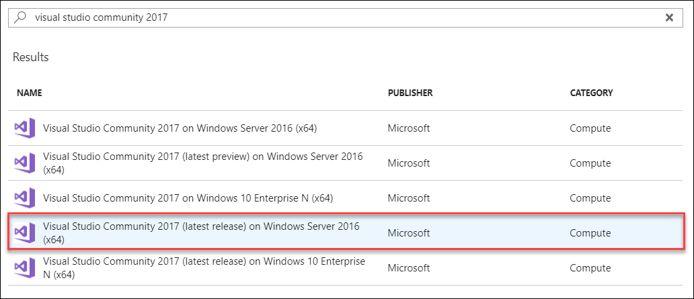
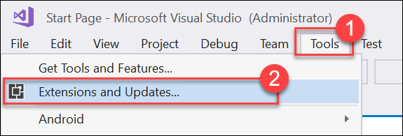
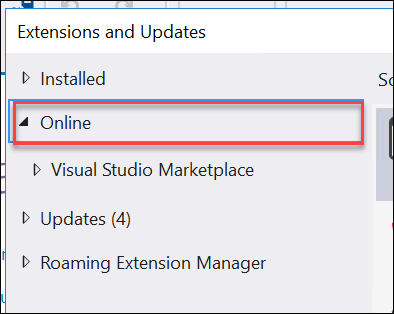
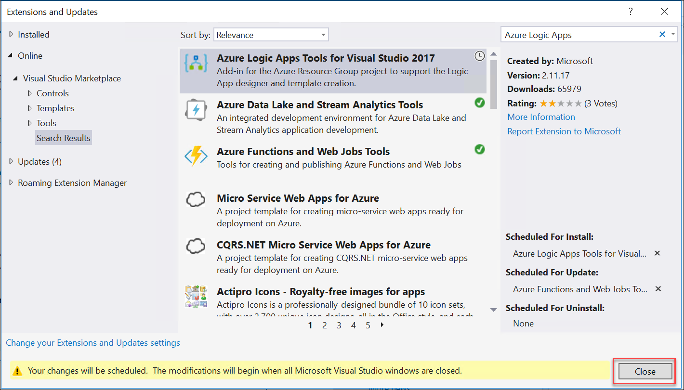
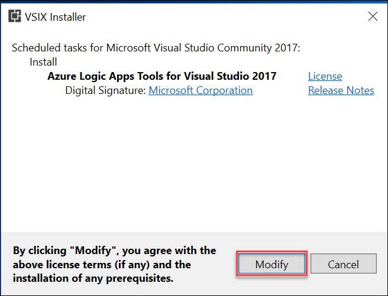
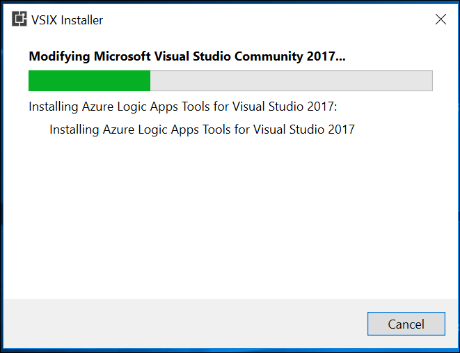
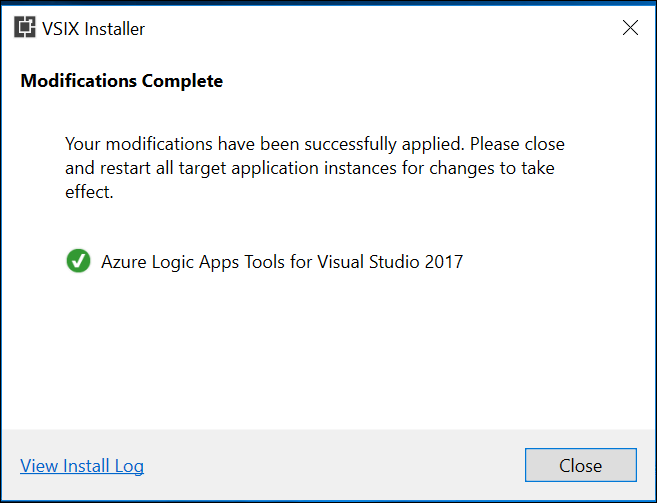

# Media AI setup

## Requirements

-   Microsoft Azure subscription

-   Local machine or Azure virtual machine configured with:

-   Visual Studio 2017 Community Edition or later

## Before the hands-on lab

Duration: 30 minutes

In this lab, you will create a developer environment and download the required files for this course if you do not already have one that meets the requirements.

### Prerequisites

1.  Microsoft Azure subscription <http://azure.microsoft.com/en-us/pricing/free-trial/>

2.  Client computer with Windows 7 or later with Visual Studio 2017

### Task 1: Configure a development environment

If you do not have a machine setup with Visual Studio 2017 Community complete this task.

1.  Create a virtual machine in Azure using the **Visual Studio Community 2017 (latest release) on Windows Server 2016 (x64)** image. This is important as you need to have Visual Studio 2017 version 15.4 or later to complete this lab.

    

It is **highly** recommended to use a DS2 or D2 instance size for this VM.

### Task 2: Disable IE enhanced security

Note: Sometimes this image has IE ESC disabled, and sometimes it does not.

1.  On the new VM, you just created click the Server Manager icon

    

2.  Click Local Server

    

3.  On the right side of the pane, click **On** by IE Enhanced Security Configuration

    

4.  Change to **Off** for Administrators and click **OK**

    

### Task 3: Update Visual Studio Tools for Azure Functions

1.  Open Visual Studio 2017, then click on the **Tools** menu, then click on **Extensions and Updates...**

    

1.  On the Extensions and Updates dialog, click on **Updates**, then **Visual Studio Marketplace** on the left side of the dialog, then click on **Update** for the **Azure Functions and Web Jobs Tools** extension to update to the latest version

    

### Task 4: Install Visual Studio Tools for Logic Apps

1.  Within the **Extensions and Updates** dialog within Visual Studio 2017 sill open from the previous task, click on the **Online** category on the left side of the dialog.\
    

2.  In the **Search** box in the upper right of the dialog, type in **Azure Logic Apps** to search for the **Azure Logic Apps Tools for Visual Studio** extension. Then click **Download** on the Extension to install it.\
    
    

3.  Click **Close** on the **Extensions and Updated** dialog

4.  Close Visual Studio, the pending installation of the Azure Logic Apps Tools for Visual Studio will automatically launch

5.  On the **VSIX Installer** dialog, click on **Modify**\
    

6.  Wait for the extension to be installed, this should only take about 1 minute\
    

7.  Once installation is complete, click **Close**\
    

8.  Restart Visual Studio now that the extension has been installed

### Task 5: Validate connectivity to Azure

1.  From within the virtual machine, Launch Visual Studio 2017 and validate that you can login with your Microsoft Account when prompted

2.  Validate connectivity to your Azure subscription. Launch Visual Studio, open Server Explorer from the View menu, and ensure that you can connect to your Azure subscription

    

### Task 6: Download the exercise files 

1.  Download the exercise files for the training (from within the virtual machine)

    a.  Create a new folder on your computer named **C:\\Hackathon**

    b.  Download the support files (.zip format), <https://cloudworkshop.blob.core.windows.net/media-services-and-cdn/Media-Services-Student-Files.zip> to the new folder.

    c.  Extract the contents to the same folder
