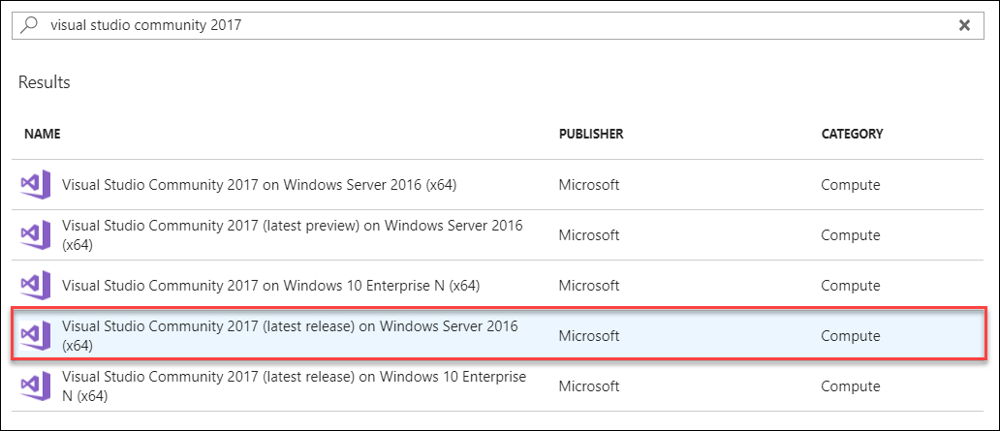
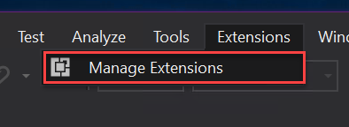
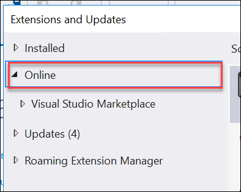
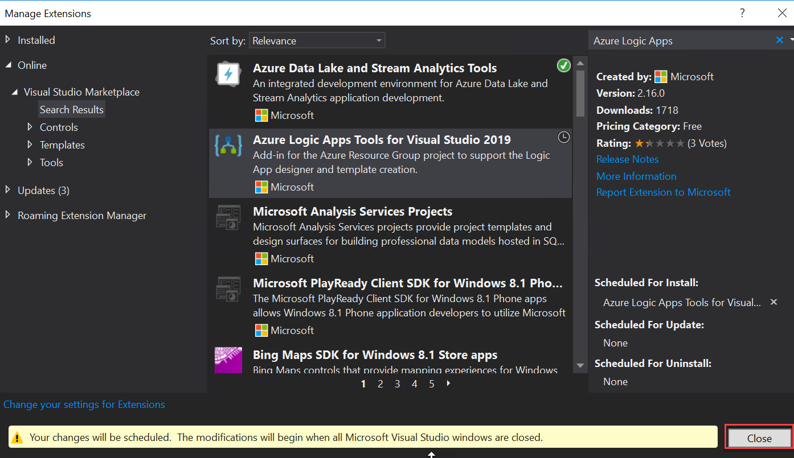
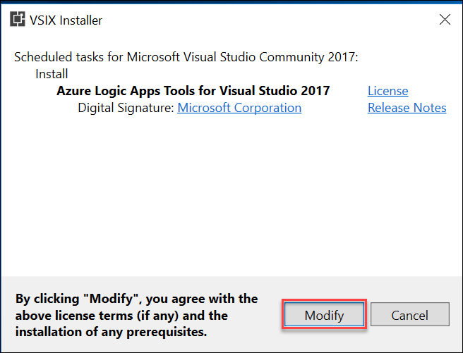
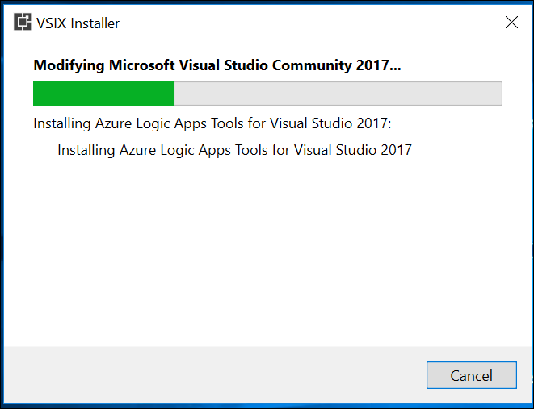
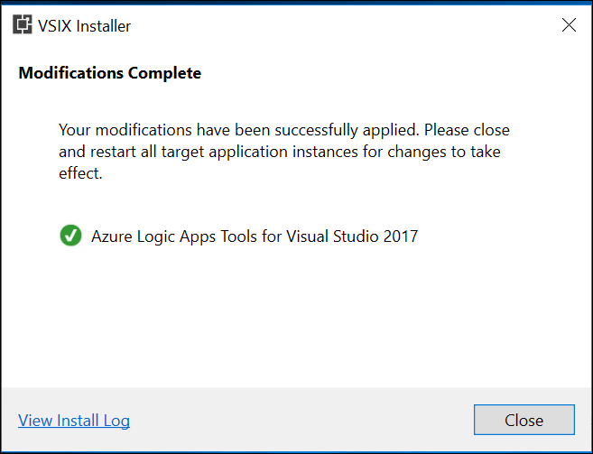
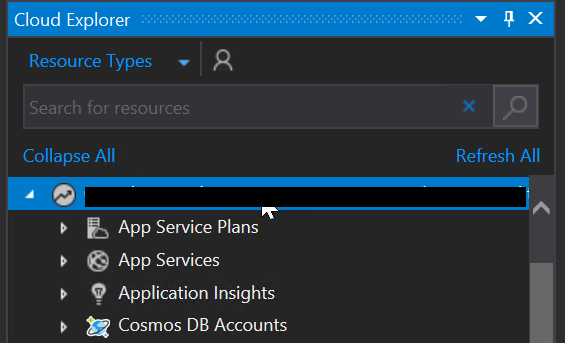

Media AI 

Before the hands-on lab setup guide

January 2019

Information in this document, including URL and other Internet Web site references, is subject to change without notice. Unless otherwise noted, the example companies, organizations, products, domain names, e-mail addresses, logos, people, places, and events depicted herein are fictitious, and no association with any real company, organization, product, domain name, e-mail address, logo, person, place or event is intended or should be inferred. Complying with all applicable copyright laws is the responsibility of the user. Without limiting the rights under copyright, no part of this document may be reproduced, stored in or introduced into a retrieval system, or transmitted in any form or by any means (electronic, mechanical, photocopying, recording, or otherwise), or for any purpose, without the express written permission of Microsoft Corporation.

Microsoft may have patents, patent applications, trademarks, copyrights, or other intellectual property rights covering subject matter in this document. Except as expressly provided in any written license agreement from Microsoft, the furnishing of this document does not give you any license to these patents, trademarks, copyrights, or other intellectual property.

The names of manufacturers, products, or URLs are provided for informational purposes only and Microsoft makes no representations and warranties, either expressed, implied, or statutory, regarding these manufacturers or the use of the products with any Microsoft technologies. The inclusion of a manufacturer or product does not imply endorsement of Microsoft of the manufacturer or product. Links may be provided to third party sites. Such sites are not under the control of Microsoft and Microsoft is not responsible for the contents of any linked site or any link contained in a linked site, or any changes or updates to such sites. Microsoft is not responsible for webcasting or any other form of transmission received from any linked site. Microsoft is providing these links to you only as a convenience, and the inclusion of any link does not imply endorsement of Microsoft of the site or the products contained therein.

© 2018 Microsoft Corporation. All rights reserved.

Microsoft and the trademarks listed at <https://www.microsoft.com/en-us/legal/intellectualproperty/Trademarks/Usage/General.aspx> are trademarks of the Microsoft group of companies. All other trademarks are property of their respective owners.

**Contents**

<!-- TOC -->

- [Media AI before the hands-on lab setup guide](#media-ai-before-the-hands-on-lab-setup-guide)
  - [Requirements](#requirements)
  - [Before the hands-on lab](#before-the-hands-on-lab)
    - [Task 1: Configure a development environment](#task-1-configure-a-development-environment)
    - [Task 2: Disable IE enhanced security](#task-2-disable-ie-enhanced-security)
    - [Task 3: Update Visual Studio Tools for Azure Functions](#task-3-update-visual-studio-tools-for-azure-functions)
    - [Task 4: Install Visual Studio Tools for Logic Apps](#task-4-install-visual-studio-tools-for-logic-apps)
    - [Task 5: Validate connectivity to Azure](#task-5-validate-connectivity-to-azure)
    - [Task 6: Download the exercise files](#task-6-download-the-exercise-files)

<!-- /TOC -->

# Media AI before the hands-on lab setup guide 

## Requirements

-   Microsoft Azure subscription <http://azure.microsoft.com/en-us/pricing/free-trial/>

-   Local machine or Azure virtual machine configured with:

    -   Visual Studio 2017 Community Edition or later

## Before the hands-on lab

Duration: 30 minutes

In this lab, you will create a developer environment and download the required files for this course if you do not already have one that meets the requirements.

### Task 1: Configure a development environment

If you do not have a machine setup with Visual Studio 2017 Community complete this task.

1.  Create a virtual machine in Azure using the **Visual Studio Community 2017 (latest release) on Windows Server 2016 (x64)** image. This is important as you need to have Visual Studio 2017 version 15.4 or later to complete this lab.

    

    > It is **highly** recommended to use a DS2_v2 or D2s_v3 instance size for this VM.

    > You will also need to make sure to enable RDP (port 3389) inbound access to the VM.

### Task 2: Disable IE enhanced security

> Note: Sometimes this image has IE ESC disabled, and sometimes it does not.

1.  On the new VM, you just created click the Server Manager icon.

    

2.  Click Local Server.

    

3.  On the right side of the pane, click **On** by IE Enhanced Security Configuration.

    

4.  Change to **Off** for Administrators and click **OK**.

    

### Task 3: Update Visual Studio Tools for Azure Functions

1.  Open Visual Studio 2017, then click on the **Tools** menu, then click on **Extensions and Updates...**.

    

1.  On the Extensions and Updates dialog, click on **Updates**, then **Visual Studio Marketplace** on the left side of the dialog, then click on **Update** for the **Azure Functions and Web Jobs Tools** extension to update to the latest version.

    

### Task 4: Install Visual Studio Tools for Logic Apps

1.  Within the **Extensions and Updates** dialog within Visual Studio 2017 sill open from the previous task, click on the **Online** category on the left side of the dialog.

    

2.  In the **Search** box in the upper right of the dialog, type in **Azure Logic Apps** to search for the **Azure Logic Apps Tools for Visual Studio** extension. Then click **Download** on the Extension to install it.

    

3.  Click **Close** on the **Extensions and Updated** dialog.

    

4.  Close Visual Studio, the pending installation of the Azure Logic Apps Tools for Visual Studio will automatically launch.

5.  On the **VSIX Installer** dialog, click on **Modify**.

    

6.  Wait for the extension to be installed, this should only take about 1 minute.

    

7.  Once installation is complete, click **Close**.

    

8.  Restart Visual Studio now that the extension has been installed.

### Task 5: Validate connectivity to Azure

1.  From within the virtual machine, Launch Visual Studio 2017 and validate that you can login with your Microsoft Account when prompted.

2.  Validate connectivity to your Azure subscription. Launch Visual Studio, open Server Explorer from the View menu, and ensure that you can connect to your Azure subscription.

    

### Task 6: Download the exercise files 

1.  Download the exercise files for the training (from within the virtual machine).

    a.  Create a new folder on your computer named **C:\\Hackathon**.

    b.  Download the support files (.zip format), <https://cloudworkshop.blob.core.windows.net/media-services-and-cdn/Media-Services-Student-Files.zip> to the new folder.

    c.  Extract the contents to the same folder.

You should follow all steps provided *before* performing the Hands-on lab.