<div class="MCWHeader1">
Media AI
</div>

<div class="MCWHeader2">
Hands-on lab step-by-step
</div>

<div class="MCWHeader3">
May 2019
</div>

Information in this document, including URL and other Internet Web site references, is subject to change without notice. Unless otherwise noted, the example companies, organizations, products, domain names, e-mail addresses, logos, people, places and events depicted herein are fictitious and no association with any real company, organization, product, domain name, e-mail address, logo, person, place or event is intended or should be inferred. Complying with all applicable copyright laws is the responsibility of the user. Without limiting the rights under copyright, no part of this document may be reproduced, stored in or introduced into a retrieval system, or transmitted in any form or by any means (electronic, mechanical, photocopying, recording, or otherwise), or for any purpose, without the express written permission of Microsoft Corporation.

Microsoft may have patents, patent applications, trademarks, copyrights, or other intellectual property rights covering subject matter in this document. Except as expressly provided in any written license agreement from Microsoft, the furnishing of this document does not give you any license to these patents, trademarks, copyrights, or other intellectual property.

The names of manufacturers, products, or URLs are provided for informational purposes only and Microsoft makes no representations and warranties, either expressed, implied, or statutory, regarding these manufacturers or the use of the products with any Microsoft technologies. The inclusion of a manufacturer or product does not imply endorsement of Microsoft of the manufacturer or product. Links may be provided to third party sites. Such sites are not under the control of Microsoft and Microsoft is not responsible for the contents of any linked site or any link contained in a linked site, or any changes or updates to such sites. Microsoft is not responsible for webcasting or any other form of transmission received from any linked site. Microsoft is providing these links to you only as a convenience and the inclusion of any link does not imply endorsement of Microsoft of the site or the products contained therein.

© 2019 Microsoft Corporation. All rights reserved.

Microsoft and the trademarks listed at <https://www.microsoft.com/en-us/legal/intellectualproperty/Trademarks/Usage/General.aspx> are trademarks of the Microsoft group of companies. All other trademarks are property of their respective owners.

**Contents**

<!-- TOC -->

- [Media AI hands-on lab step-by-step](#media-ai-hands-on-lab-step-by-step)
  - [Abstract and learning objectives](#abstract-and-learning-objectives)
  - [Overview](#overview)
  - [Solution architecture](#solution-architecture)
  - [Requirements](#requirements)
  - [Exercise 1: Signup for Video Indexer API service](#exercise-1-signup-for-video-indexer-api-service)
    - [Task 1: Signup for Video Indexer](#task-1-signup-for-video-indexer)
    - [Task 2: Copy Video Indexer API Key](#task-2-copy-video-indexer-api-key)
    - [Task 3: Copy Video Indexer Account ID](#task-3-copy-video-indexer-account-id)
  - [Exercise 2: Setup video import workflow](#exercise-2-setup-video-import-workflow)
    - [Task 1: Create storage account for video files](#task-1-create-storage-account-for-video-files)
    - [Task 2: Create Azure Logic App to process videos](#task-2-create-azure-logic-app-to-process-videos)
  - [Exercise 3: Enable admin website to upload videos](#exercise-3-enable-admin-website-to-upload-videos)
    - [Task 1: Provision Cosmos DB Account](#task-1-provision-cosmos-db-account)
    - [Task 2: Integrate Cosmos DB into admin web app](#task-2-integrate-cosmos-db-into-admin-web-app)
    - [Task 3: Integrate file upload into admin web app](#task-3-integrate-file-upload-into-admin-web-app)
    - [Task 4: Add ability to delete video](#task-4-add-ability-to-delete-video)
    - [Task 5: Deploy admin website to an Azure Web App](#task-5-deploy-admin-website-to-an-azure-web-app)
    - [Task 6: Configure application settings](#task-6-configure-application-settings)
  - [Exercise 4: Update video status when processing is complete](#exercise-4-update-video-status-when-processing-is-complete)
    - [Task 1: Create Azure Function](#task-1-create-azure-function)
    - [Task 2: Update Video State when processing is complete](#task-2-update-video-state-when-processing-is-complete)
  - [Exercise 5: Add video player to front-end application](#exercise-5-add-video-player-to-front-end-application)
    - [Task 1: Integrate Cosmos DB into front-end application](#task-1-integrate-cosmos-db-into-front-end-application)
    - [Task 2: Display video thumbnail image](#task-2-display-video-thumbnail-image)
    - [Task 3: Add video player](#task-3-add-video-player)
    - [Task 4: Add video insights](#task-4-add-video-insights)
    - [Task 5: Integrate video player and insights together](#task-5-integrate-video-player-and-insights-together)
    - [Task 6: Deploy public website to an Azure Web App](#task-6-deploy-public-website-to-an-azure-web-app)
    - [Task 7: Configure application settings](#task-7-configure-application-settings)
  - [Exercise 6: Test the application](#exercise-6-test-the-application)
    - [Task 1: Upload video to admin website](#task-1-upload-video-to-admin-website)
    - [Task 2: View video and insights in public website](#task-2-view-video-and-insights-in-public-website)
  - [After the hands-on lab](#after-the-hands-on-lab)
    - [Task 1: Delete resources](#task-1-delete-resources)

<!-- /TOC -->

# Media AI hands-on lab step-by-step

## Abstract and learning objectives

In this hands-on lab, you will build, setup and configure a Web Application that performs media streaming using Azure Services; including the Video Indexer API. You will also learn how to implement video processing using Logic Apps, Azure Functions and Video Indexer API to encode and transcribe videos.

At the end of this hands-on lab you will be better able to build and manage media applications including the setup the Video Indexer API, upload videos to Blob Storage to be encoded with Azure Video Indexer and integrate Video Indexer through Logic Apps and Azure Functions.

## Overview

Contoso has asked you to build a media streaming service so they can deliver their on-demand video training courses to their customers. For this solution, Contoso wants to use PaaS and Serverless services within the Microsoft Azure platform to help minimize development time and increase ease of maintenance. They would also like you to integrate automatic transcript generation and caption translation within the video encoding process so overall video production cost can be reduced, as well as improving the video player experience for their customers across the globe.

## Solution architecture

![Icons that are connected by arrows comprise this rectangular diagram. From the top left, Web App -- Admin Site points linearly down to Azure Storage, which points right to a blue box labeled Azure Logic App. In this box, Azure Logic App points at Video Indexer Connector and the blue box points right to Video Indexer Service. The rest of the icons use double-sided arrows and point to and from: Video Indexer Service up to Web App -- Frontend, left to Database, which points down through the middle of the rectangle to Azure Function and back down to the blue Azure Logic App box. A double-sided arrow also connects Azure Function to Video Indexer Service and on the right side, a double-sided arrow points from Web App -- Frontend to Media Player.](images/Hands-onlabstep-by-step-MediaAIimages/media/image2.png "Solution architecture diagram")

## Requirements

-   Microsoft Azure subscription: <http://azure.microsoft.com/en-us/pricing/free-trial/>

-   Local machine or Azure LABVM virtual machine configured with:

    -   Visual Studio 2017 Community Edition or later


## Exercise 1: Signup for Video Indexer API service

Duration: 15 minutes

In this exercise, you will setup the Video Indexer API within Microsoft Azure.

### Task 1: Signup for Video Indexer

1. Open a new browser window / tab and navigate to <https://api-portal.videoindexer.ai>.
   
   ```
   https://api-portal.videoindexer.ai
   ```
2. Select the **SIGN IN** link in the upper-right.

    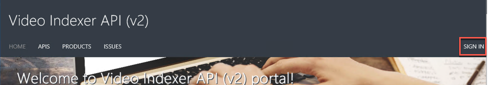

3. Sign in with your **Microsoft** or **Azure AD** credentials. Use the same credentials you login to your Azure Subscription with.

    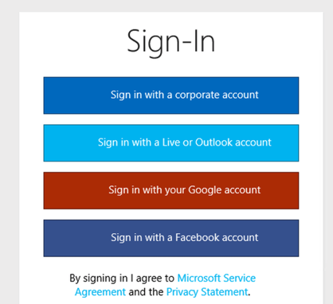

4. The first time you sign in, you will be prompted to authorize the **www.videoindexer.ai** application with permissions for your account.

    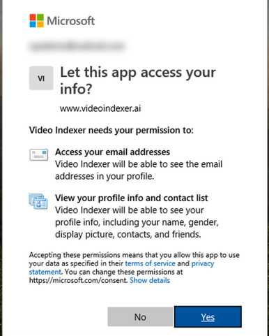

5. Once signed up and signed in, select on the **PRODUCTS** menu at the top.

    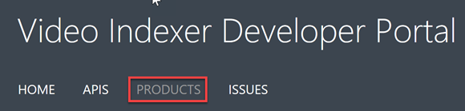

6. Select the **Authorization** product link.

    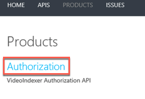

7. Select the **Product Authorization Subscription** created for you to view the subscription details

    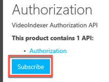

### Task 2: Copy Video Indexer API Key

1. While on the **Profile** page of the **Video Indexer Developer Portal**, locate the **Subscription details** for the **Authorization** subscription.

2. Choose the **Show** link next to the **Primary key** to reveal the API key.

    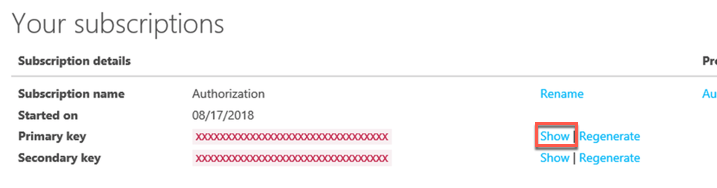

3. Copy the **Primary key** for the **Free preview** subscription and save this for use later.

    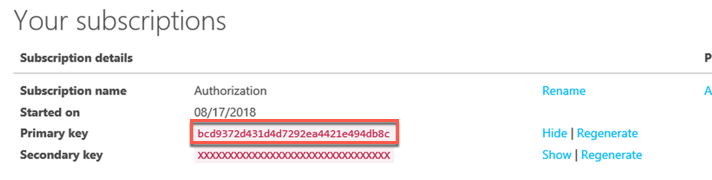

### Task 3: Copy Video Indexer Account ID

1. In a web browser, navigate to <https://videoindexer.ai> and login.
   
    ```
    www.videoindexer.ai
    ```

2. Click on your **user avatar** image in the top-right of the page, then click on the **Settings** menu item.

    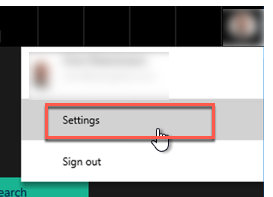

3. Click on the **Account** tab.

    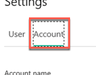

4. Copy the **Account ID** and save it for use later.

    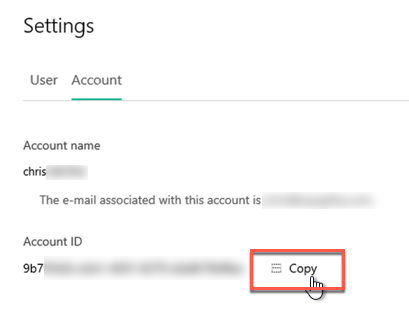

## Exercise 2: Setup video import workflow

    - Duration: 20 minutes

In this exercise, you will set the import workflow for uploading and importing videos using the Video Indexer API.

### Task 1: Create storage account for video files

1. Open a browser window and login to the Azure Portal: <http://portal.azure.com>.

2. In the menu, select **+Create a resource**, then **Storage** and **Storage account**.

    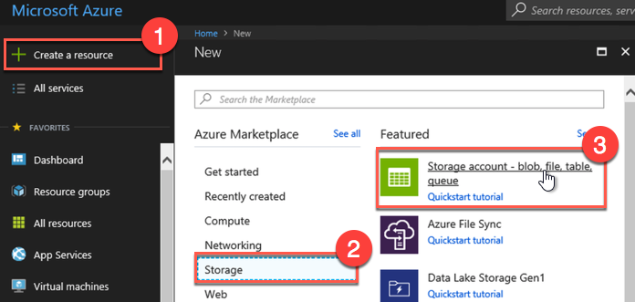

3. On the **Create storage account** blade in the **Basics** tab, enter the following values:

    - Under **Subscription**, locate **Resource group** select **Create new**

    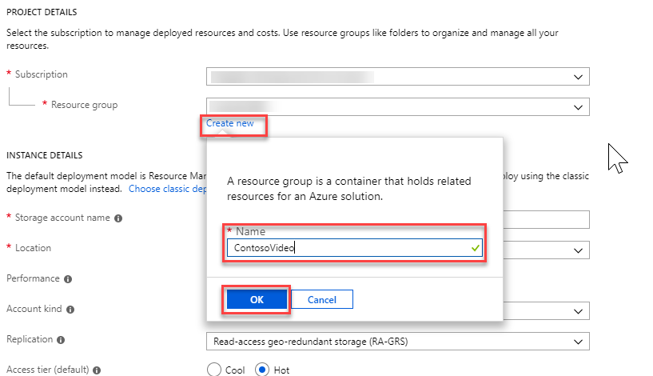

    - Name: **enter a unique name**

    - Replication: **Locally-redundant storage (LRS)**

    - Resource Group: **ContosoVideo**

    - Location: **Choose the location closest to you.**

    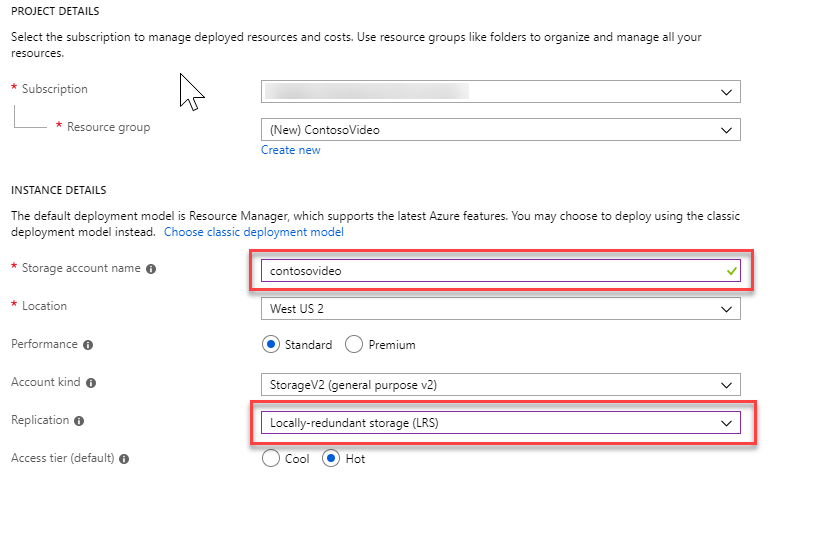

4. Select **Review + Create**, review the details then select **Create**.
       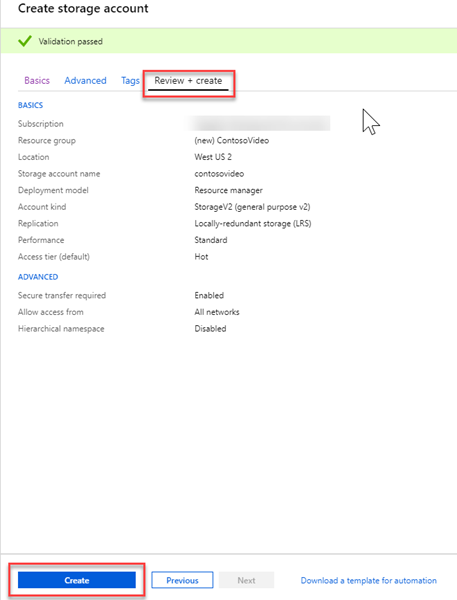
5. In the menu, choose **Resource groups**, then select the **ContosoVideo** Resource group, then pick the **Storage Account** that was just created.

    

6. On the **Storage account** blade, choose the **Blobs** link under Services to get started creating a new Blob Container.

    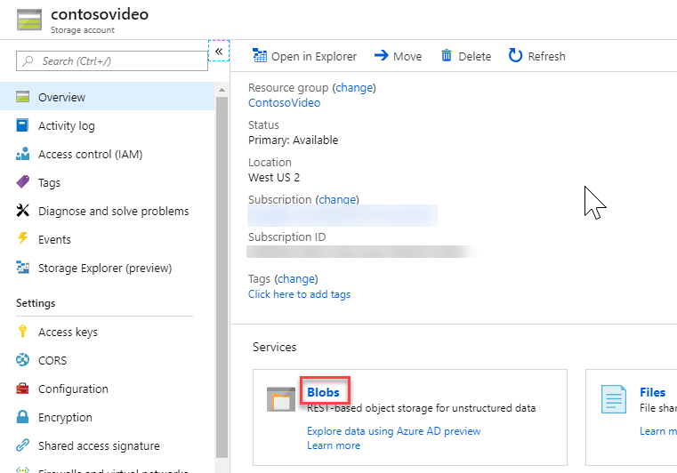

7. Select the **+Container** button.

    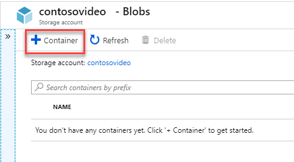

8. Enter **video** for the name of the new Container, leave the Public access level set to **Private**, then choose **OK**.
  
    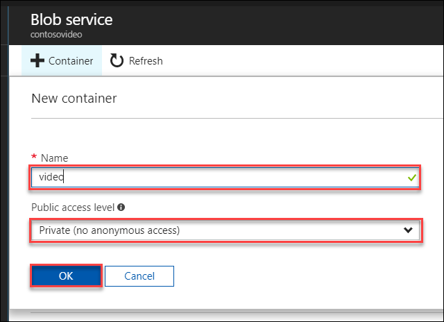

9. In the left pane of the Storage Account blade, select **Access keys**, then copy the "primary" **key1**. Save this for reference later.

    

### Task 2: Create Azure Logic App to process videos

1. Open a browser window and login to the Azure Portal: <http://portal.azure.com> if you haven't already. 

2. In the menu, select **Create a resource** > **Web** > **Logic App**.

3. On the **Create Logic App** blade, enter the following values:

    - Name: **enter a unique name**
    
    - Resource group: **ContosoVideo**
    
    - Location: **choose the location closest to you**
    
    - Log Analytics: **Off**

    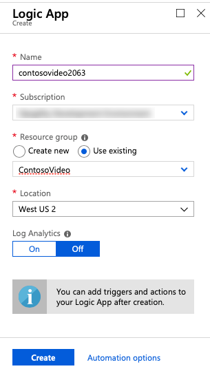

4. Click **Create**.

5. In the menu, choose **Resource groups**, then select the **ContosoVideo** Resource group, then pick the **Logic App** that was just created.

6. The **Logic Apps Designer** should open automatically. If it doesn't, click to open the Logic Apps Designer.

7. Scroll down and select the **Blank Logic App** template.

    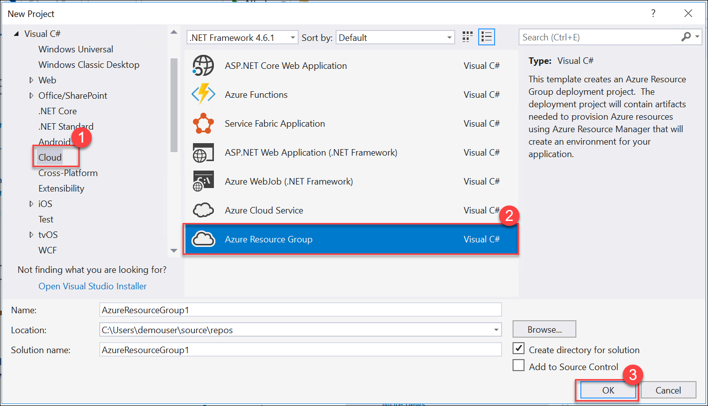

8. Start building out the Logic App Workflow by searching for and adding the **Azure Blob Storage - When a blob is added or modified (properties only)** trigger.

    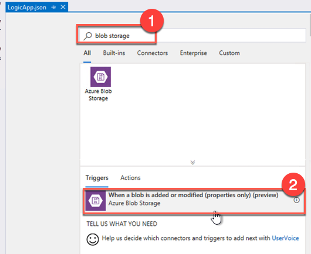

9. Enter a name in the **Connection Name** field, then select the **Storage Account** that was previously created, then select **Create**.

    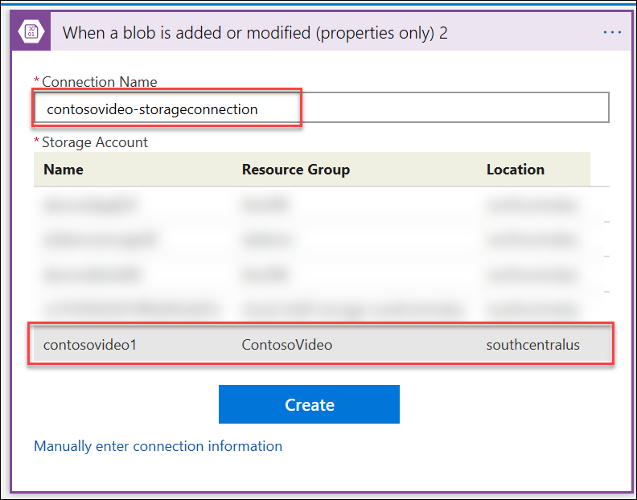

10. On the **Blob Storage Trigger**, enter the following values:

    - Container: **video**

    - Interval: **1**

    - Frequency: **Minute**

    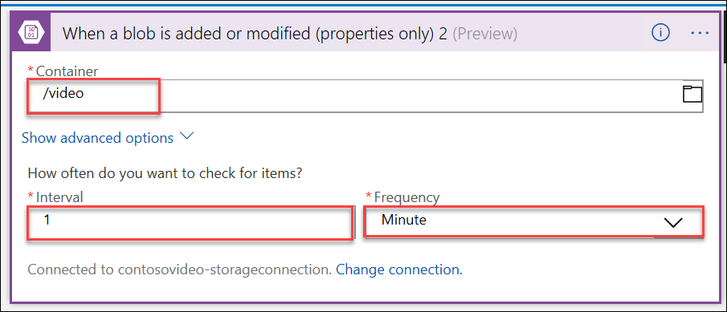

11. Select **+New step**.

    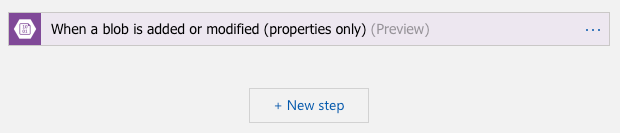

12. Search for and add the **Azure Blob Storage -- Create SAS URI by path** action.

    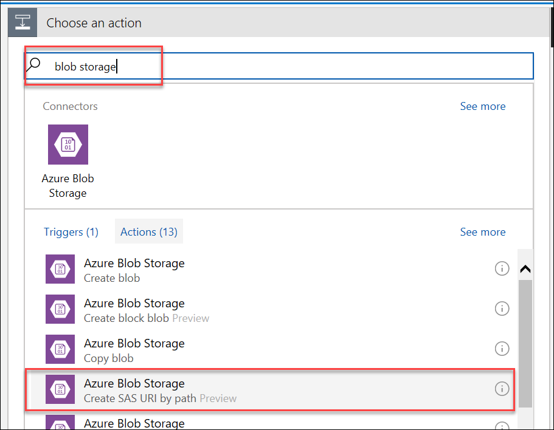

13. Select the **Blob path** field, then choose to insert the **List of Files Path** parameter into the field from the options that display in the **Dynamic Content** section. This will use the Path of the Blob from the Trigger as the value to use when creating the SAS URI in this Action.

    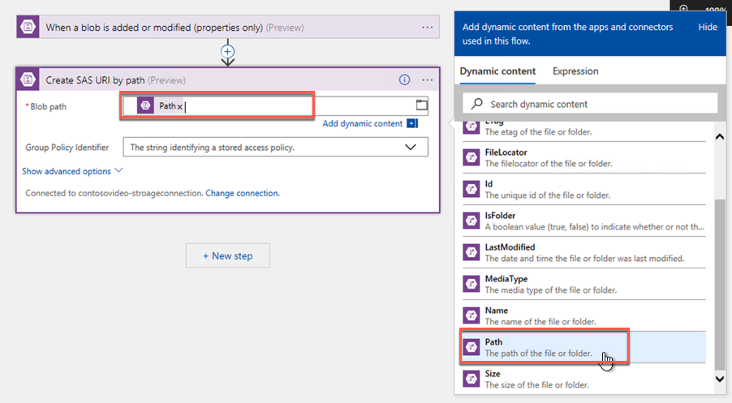

14. Choose **+ New step** and search for **Video Indexer** then select the **Get Account Access Token** Action.

    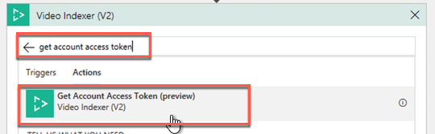

15. For Connection Name, enter **contosovideo-videoindexconnection** , for API Key, enter the API key from when the video index account was set up. Then click **Create**.

    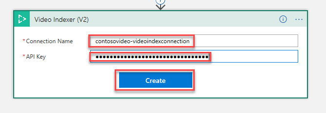

16. Enter the following values for the **Video Indexer -- Get account access token** Action:

    - Location: **trial**
    - Account ID: **Select your Video Indexer Account ID from the dropdown.**
    - Allow Edit: **Yes**

    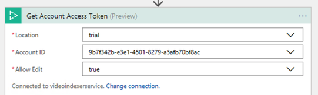

17. Choose **+New step** and select the **Video Indexer -- Upload video and index** Action.

     action")

18. Enter the following values for the **Video Indexer -- Upload video and index (using a URL)** action:

    - Location: **trial**
    - Account ID: **Select your Video Indexer Account ID from the dropdown**.
    - Access Token: **Choose the **Access Token** output from the **Get Account Access Token** action.**

        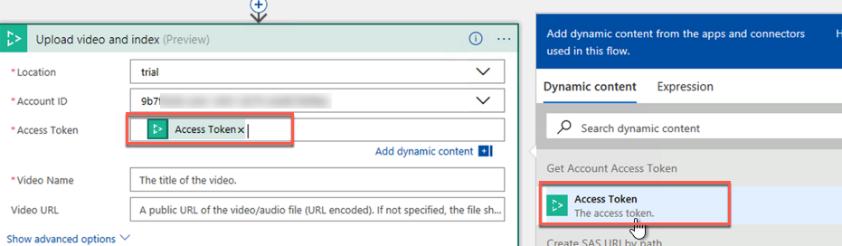

    - Video Name: Choose the **List of Files DisplayName** parameter from the **When one or more blobs are added or modified** action.

        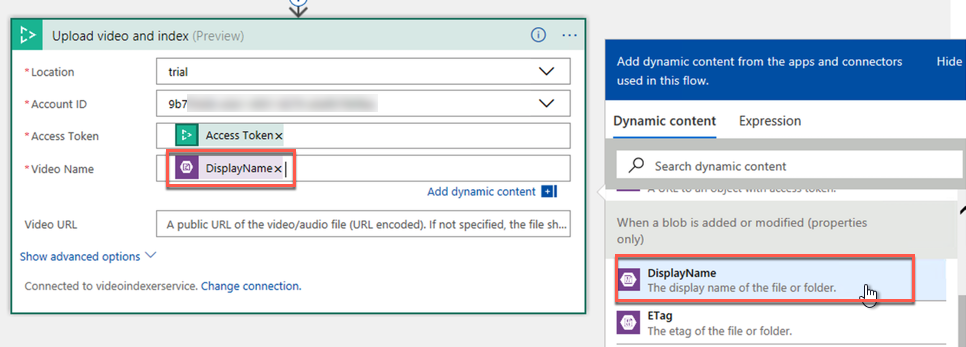

    - Video URL: Choose the **Web URL** parameter from the **Create SAS URI by path** action.

        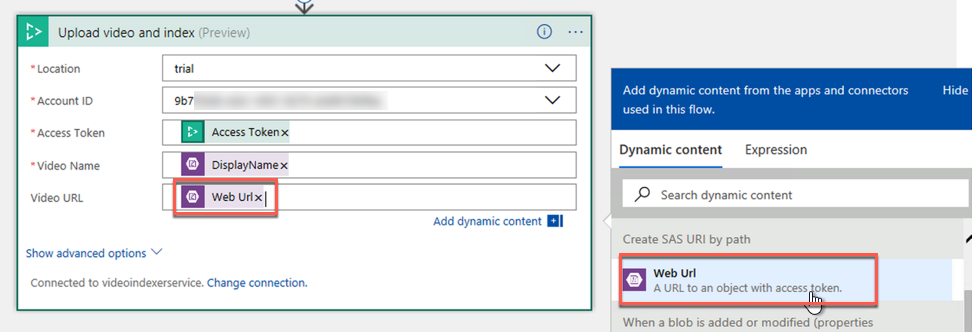

19. Save the Logic App.

    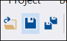

20. Click the **Run** button to start the Logic App.

    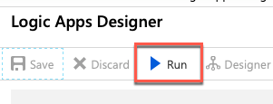

## Exercise 3: Enable admin website to upload videos

Duration: 45 minutes

In this exercise, you will wire up the Admin website to enable Video Upload functionality.

### Task 1: Provision Cosmos DB Account

1. In the menu, choose **+Create a resource**, then **Databases**, then **Azure Cosmos DB**.

    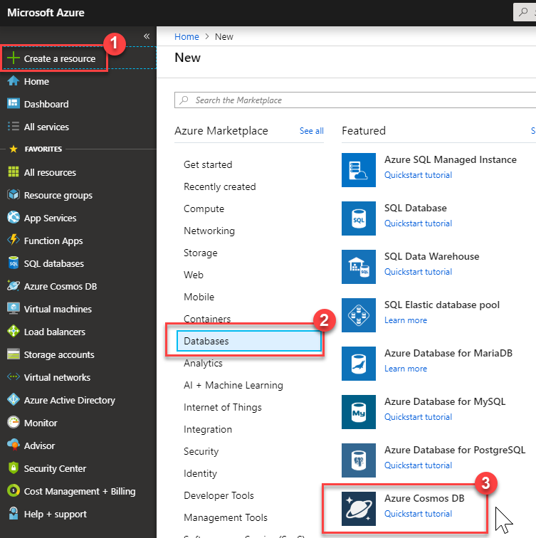

2. On the **Create Azure Cosmos DB account** blade in the **Basics** tab, enter or confirm the following values:

    - Account Name: **enter a unique name**

    - API: **Core SQL**

    - Resource Group: **ContosoVideo**

    - Location: **Choose the same location as previously.**
  
    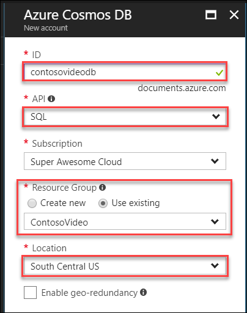

3. Choose **Review + Create** then **Create**.

4. In the menu, select **Resource groups**, then select the **ContosoVideo** Resource group, then choose **Cosmos DB Account** that was just created.

    

5. On the **Cosmos DB Account** blade, select **Data Explorer**.

    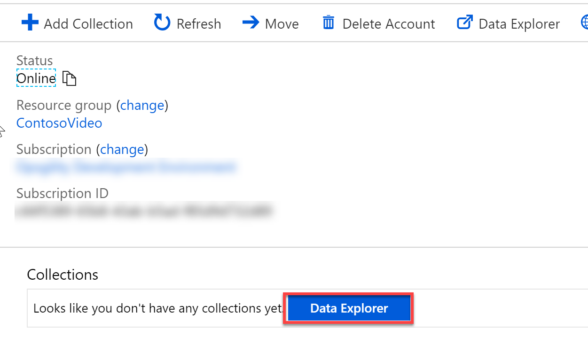

6. Choose **New Container**.

   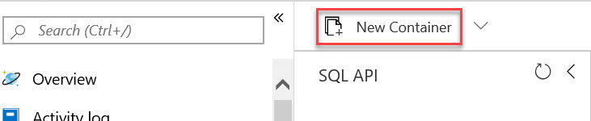

7. On the **Add Container** pane, enter the following values:

    - Database id: **learning**

    - Container Id: **videos**

    - Partition Key: **/videoId**

    - Throughput: **400**

    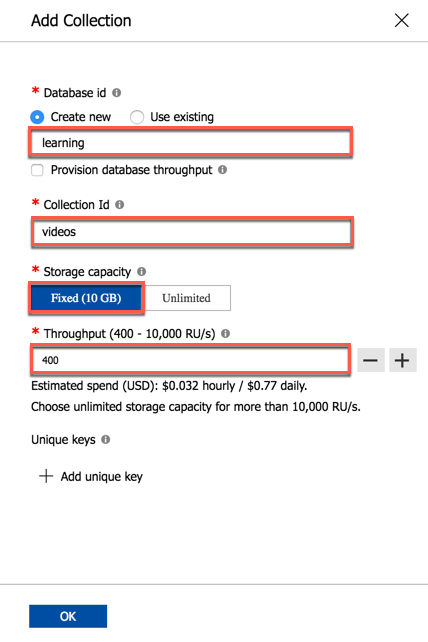

8. Select **OK**.

### Task 2: Integrate Cosmos DB into admin web app

1. Within the folder where the exercise files have been extracted to, open the **ContosoLearning.sln** solution within Visual Studio 2017.

    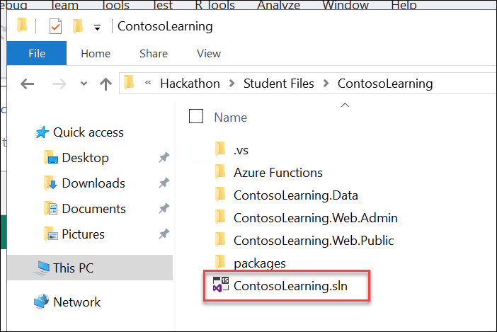

2. Within Solution Explorer, locate the **ContosoLearning.Data** project, then right-click the project and choose **Manage NuGet Packages...**

    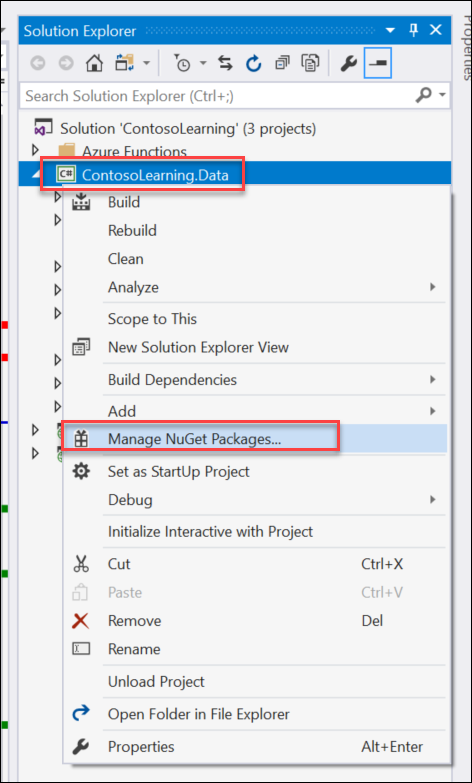

3. Within the **NuGet Package Manager**, choose **Browse**, then search for **Microsoft.Azure.DocumentDB**.

    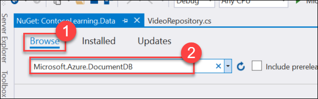

4. Select the **Microsoft.Azure.DocumentDB** NuGet Package, then choose **Install**.

    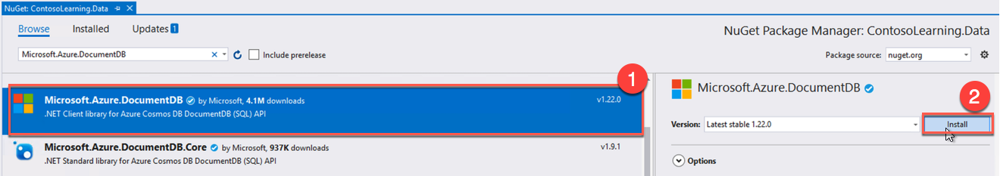

5. Choose **OK** on the **Preview Changes** dialog.

    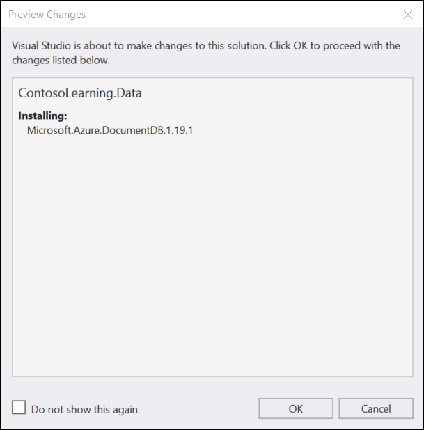

6. Select **I Accept** on the **License Acceptance** dialog.

    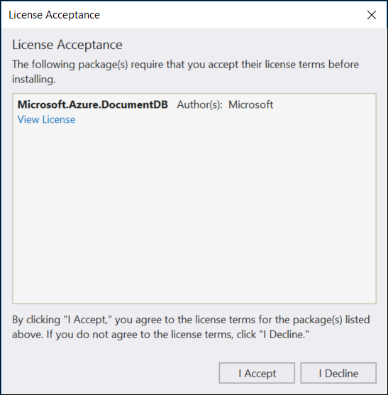

7. Within Solution Explorer, locate the **ContosoLearning.Data** project and open the **VideoRepository.cs** file. This is the source code file that will contain the source code for interactive with the Cosmos DB Database and Collection within this solution. This data access layer (DAL) implementation uses a simplified Repository pattern.

    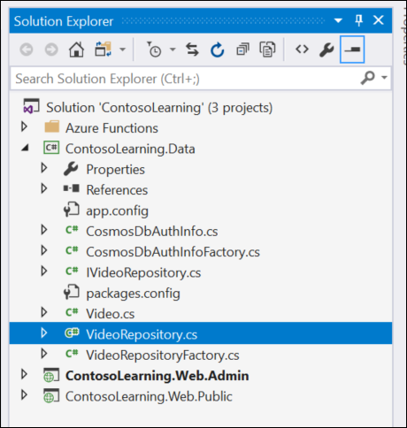

8. Add the following **using** statements to the top of the **VideoRepository.cs** file:

    ```
        using Microsoft.Azure.Documents.Client;
        using Microsoft.Azure.Documents.Linq;
    ```

9. Add the following method named **createDocumentClient()** to the **VideoRepository** class. This is a reusable method that will be used by a couple different methods within the class to instantiate a new DocumentClient class instance for working with Cosmos DB.

    ```
        private DocumentClient createDocumentClient()
        {
            return new Microsoft.Azure.Documents.Client.DocumentClient(
                new Uri(_cosmosDbAuthInfo.Endpoint),
                _cosmosDbAuthInfo.AuthKey
                );
        }
    ```

10. Modify the code for the **GetAll()** method to the following to load all Documents from Cosmos DB and return them as a list object.

    ```
        var list = new List<Video>();

        using (var documentClient = this.createDocumentClient())
        {
            var documentQuery = documentClient.CreateDocumentQuery<Video>(
                UriFactory.CreateDocumentCollectionUri(_cosmosDbAuthInfo.Database, _cosmosDbAuthInfo.Collection)
                ).AsDocumentQuery();

            while (documentQuery.HasMoreResults)
            {
                list.AddRange(
                    await documentQuery.ExecuteNextAsync<Video>()
                    );
            }
        }

        return list;
    ```

11. Notice that the above code references a **\_cosmosDbAuthInfo** object. This object is pre-populated with the necessary values for the Cosmos DB Account and Collection by loading from **AppSettings**. These AppSettings will be populated later.

12. Add the below using statement and then Replace the body of the **Get(string id)** method with the following code that will retrieve a single Document by ID.
    ```
    using Microsoft.Azure.Documents;
    ```


    ```
        using (var documentClient = this.createDocumentClient())
        {
            var response = await documentClient.ReadDocumentAsync<Video>(
                UriFactory.CreateDocumentUri(_cosmosDbAuthInfo.Database, _cosmosDbAuthInfo.Collection, id), new RequestOptions() { PartitionKey = new PartitionKey(id) }
                );

            return response.Document;
        }
    ```

13. Replace the body of the **Delete(string videoId)** method with the following code that will delete a single document by ID.

    ```
        using (var documentClient = this.createDocumentClient())
        {
            await documentClient.DeleteDocumentAsync(
                UriFactory.CreateDocumentUri(_cosmosDbAuthInfo.Database, _cosmosDbAuthInfo.Collection, videoId)
                );
        }
    ```

14. Add the following code to the **Insert(Video video)** method in place of the *"// Code Here"* comment. This code will insert a new Document into the Cosmos DB Collection:

    ```
        using (var documentClient = this.createDocumentClient())
        {
            await documentClient.CreateDocumentAsync(
                UriFactory.CreateDocumentCollectionUri(_cosmosDbAuthInfo.Database, _cosmosDbAuthInfo.Collection),
                Video
                );
        }
    ```

15. Save the file.

### Task 3: Integrate file upload into admin web app

1. Open the **ContosoLearning.sln** solution within Visual Studio 2017.

2. Within Solution Explorer, locate and expand the **ContosoLearning.Web.Admin** project.

    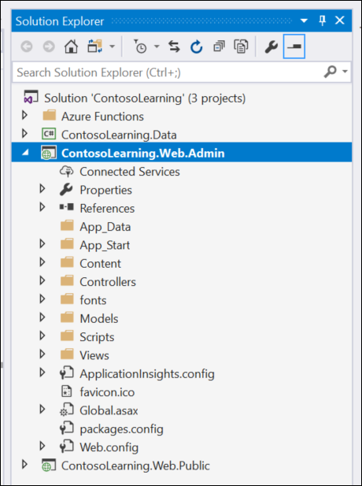

3. Expand the **Controllers** folder and open the **HomeController.cs** file.

    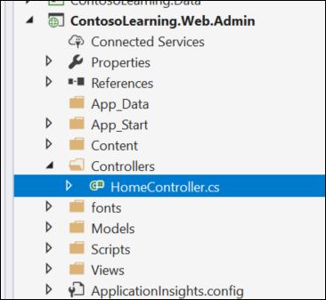

4. Add the following using statements to the top of the **HomeController.cs** file:

    ```
        using Microsoft.WindowsAzure.Storage;
        using System.Configuration;
    ```

5. Within the **HomeController**, locate the **Upload** method with the **HttpPost** attribute.

    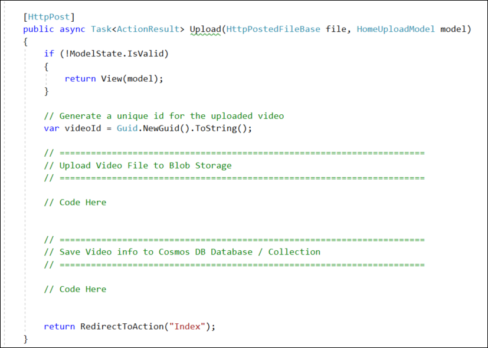

6. Paste in the following code where the comment states *"Upload Video File to Blob Storage"*. This code will take the file uploaded to the Action Method via an HTTP Post and upload that file to the Blob Storage Account.

    ```
        // Load Connection String to Azure Storage Account
        var videoConnString = ConfigurationManager.ConnectionStrings["videostorage"].ConnectionString;
        if (string.IsNullOrWhiteSpace(videoConnString))
        {
            throw new Exception("The 'videostorage' Connection String is NOT set");
        }

        // Get reference to the Blob Container to upload to
        var storageAccount = CloudStorageAccount.Parse(videoConnString);
        var blobClient = storageAccount.CreateCloudBlobClient();
        var container = blobClient.GetContainerReference("video");
        await container.CreateIfNotExistsAsync();

        // Upload Video file to Blob Storage
        var blob = container.GetBlockBlobReference(videoId);
        await blob.UploadFromStreamAsync(file.InputStream);
    ```

7. Paste in the following code where the comment states *"Save Video info to Cosmos DB..."*. This code will use the VideoRepository to save a new Document to Cosmos DB for the newly uploaded video.

    ```
        // Save new Document to Cosmos DB for this Video
        var videoRepo = VideoRepositoryFactory.Create();
        var video = new Video();
        video.Id = videoId;
        video.Title = model.Title;
        video.Description = model.Description;
        video.ProcessingState = "Processing";
        video.ProcessingProgress = "0%";
        await videoRepo.Insert(video);
    ```

8. Save the file.

### Task 4: Add ability to delete video

1. Within Solution Explorer, expand the **ContosoLearning.Web.Admin** project, then right-click on **References,** then choose **Manage NuGet Packages...**

    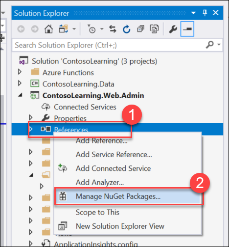

2. Within the **NuGet Package Manager,** choose **Browse**, then search for **Microsoft.Rest.ClientRuntime**.

    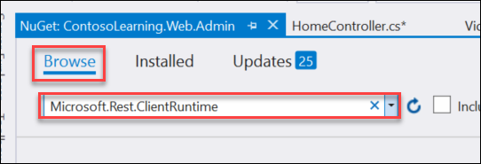

3. Select the **Microsoft.Rest.ClientRuntime** NuGet package, then choose **Install**.

    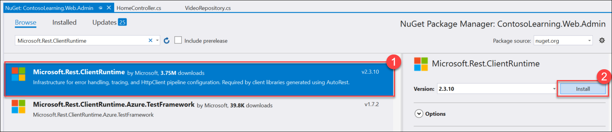

4. Select **OK** on the **Preview Changes** dialog.

    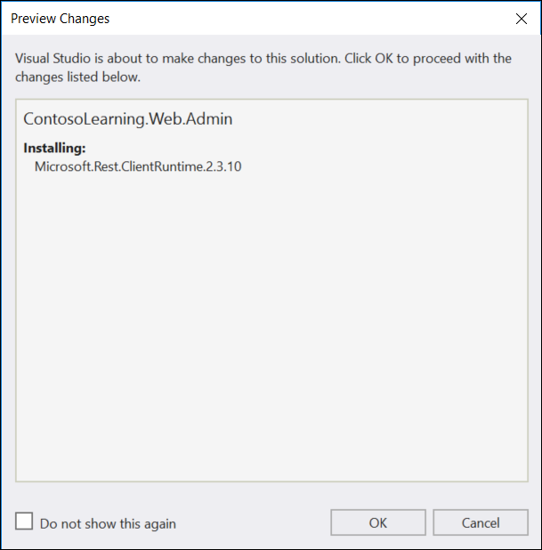

5. Choose **I Accept** on the **License Acceptance** dialog.

    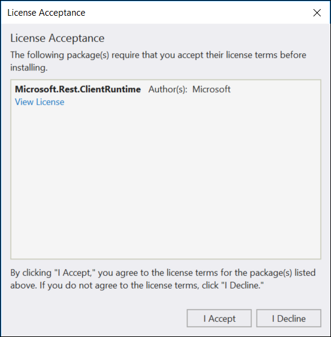

6. Within the Solution Explorer window, right-click the **ContosoLearning.Web.Admin** project, then choose **Add**, then **REST API Client...**

    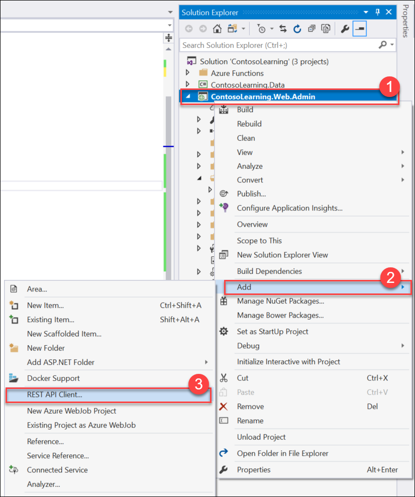

7. Open a new browser window and navigate to the **Video Indexer API** Developer Portal at: <https://api-portal.videoindexer.ai>.

8. In the top navigation, choose the **APIS** menu, then select **Operations**.

    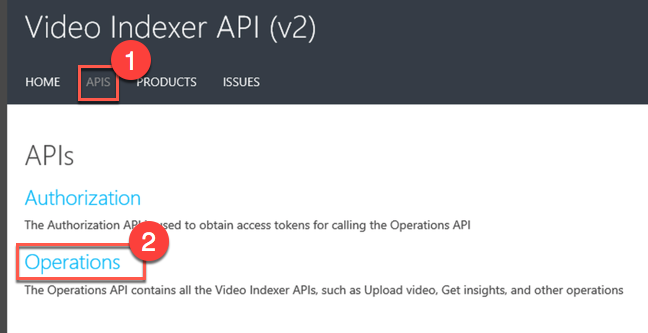

9. Choose **API definition** to expand its menu.

    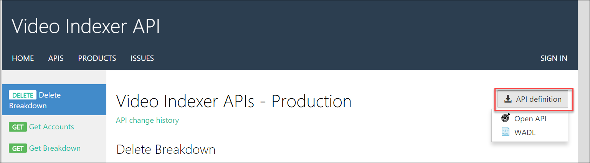

10. Right-click **Open API 2 (JSON)**, then choose **Copy link address** or **Copy Shortcut** depending on your browser to copy the URL for the link to the clipboard.

    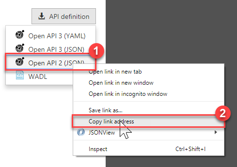

11. Go back to Visual Studio and paste in the copied **URL** into the **Swagger URL** field of the **Add REST API Client** dialog, set the **Client Namespace** to `ContosoLearning.Web.Admin.VideoIndexer.Operations`, then select **OK**.

    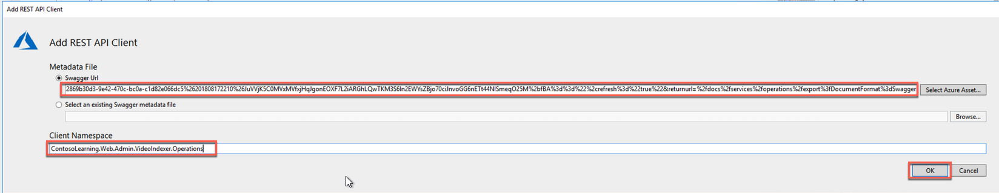

12. In the top navigation of the **Video Indexer API** Developer Portal, choose the **APIS** menu, then select **Authorization**.

    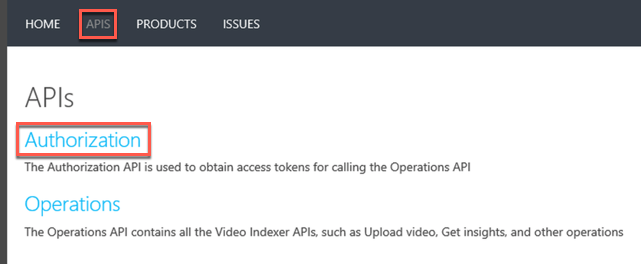

13. Choose **API definition** to expand its menu.

    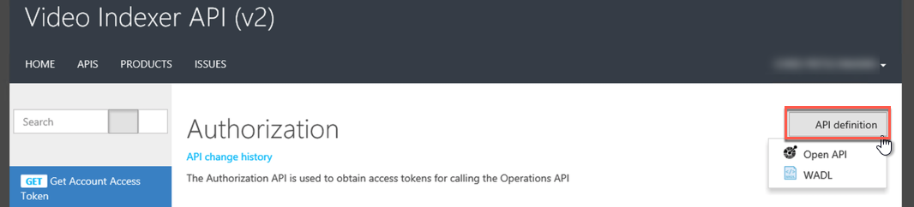

14. Right-click **Open API 2**, then choose **Copy link address** or **Copy Shortcut** depending on your browser to copy the URL for the link to the clipboard.

    

15. Go back to Visual Studio, then within the Solution Explorer window, right-click the **ContosoLearning.Web.Admin** project, then choose **Add**, then **REST API Client...**

    

16. Paste in the copied **URL** into the **Swagger URL** field of the **Add REST API Client** dialog, set the **Client Namespace** to `ContosoLearning.Web.Admin.VideoIndexer.Authorization`, then select **OK**.

    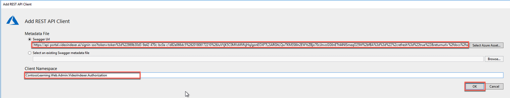

17. Within the **HomeController.cs** file within the **ContosoLearning.Web.Admin** project, locate the **Delete(string id)** Action Method and replace its contents with the following source code that will delete the Video from both Blob Storage and Cosmos DB.

    ```
        // ======================================================================
        // Delete document from Cosmos DB
        // ======================================================================

        var videoRepo = VideoRepositoryFactory.Create();

        var video = await videoRepo.Get(id);

        await videoRepo.Delete(id);

        // ======================================================================
        // Delete files from Blob Storage
        // ======================================================================

        // Load Connection String to Azure Storage Account
        var videoConnString = ConfigurationManager.ConnectionStrings["videostorage"].ConnectionString;
        if (string.IsNullOrWhiteSpace(videoConnString))
        {
            throw new Exception("The 'videostorage' Connection String is NOT set");
        }

        // Get reference to the Blob Container to upload to
        var storageAccount = CloudStorageAccount.Parse(videoConnString);
        var blobClient = storageAccount.CreateCloudBlobClient();

        // Get reference to 'video' container
        var videoContainer = blobClient.GetContainerReference("video");
        await videoContainer.CreateIfNotExistsAsync();

        // Delete Video file from Blob Storage
        var videoBlob = videoContainer.GetBlockBlobReference(id);
        await videoBlob.DeleteAsync();
    ```

18. After the above code, within the **Delete** method, paste in the following code that will also delete the video from **Video Indexer** when it's deleted from the application.

    ```
    var videoIndexerLocation = "trial";
    var videoIndexerTokenCredentials = new Microsoft.Rest.TokenCredentials(
            ConfigurationManager.AppSettings["VideoIndexerAPI_Key"]
        );
    var videoIndexerAuthClient = new VideoIndexer.Authorization.AuthorizationClient(videoIndexerTokenCredentials);

    // Get Video Indexer Account Id
    var accountsResponse = await videoIndexerAuthClient.GetAccountsWithHttpMessagesAsync(videoIndexerLocation);
    dynamic accounts = Newtonsoft.Json.Linq.JArray.Parse(await accountsResponse.Response.Content.ReadAsStringAsync());
    var videoIndexerAccountId = accounts[0].id as string;

    // Get Video Indexer Access Token
    var accountAccessTokenResponse = await videoIndexerAuthClient.GetAccountAccessTokenWithHttpMessagesAsync(videoIndexerLocation, videoIndexerAccountId, true);
    var accountAccessToken = Newtonsoft.Json.JsonConvert.DeserializeObject<string>(await accountAccessTokenResponse.Response.Content.ReadAsStringAsync());

    // Delete Video from Video Indexer Account
    var videoIndexerClient = new VideoIndexer.Operations.OperationsClient(videoIndexerTokenCredentials);
    var response = await videoIndexerClient.DeleteVideoWithHttpMessagesAsync(videoIndexerLocation, videoIndexerAccountId, video.VideoId, accountAccessToken);

    return RedirectToAction("Index");
    ```

19. Save the file.

### Task 5: Deploy admin website to an Azure Web App

1.  Within Solution Explorer, right-click the **ContosoLearning.Web.Admin** project, then choose **Publish...**

    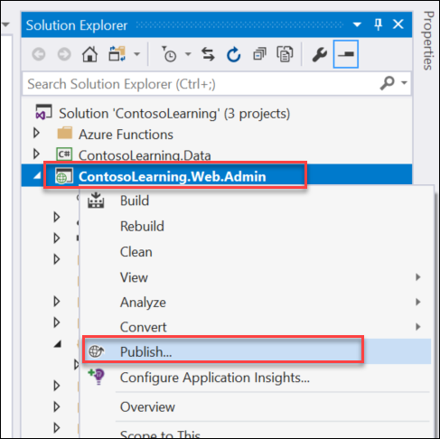

2. Select **App Service**, then select the **Create New** radio button, then choose **Publish**.

    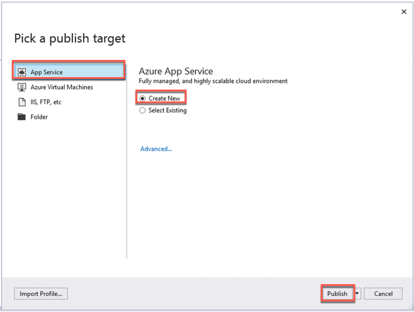

3.  On the **Create App Service** dialog, select the **ContosoVideo** Resource Group, then select **New** next to **Hosting Plan**.
 
    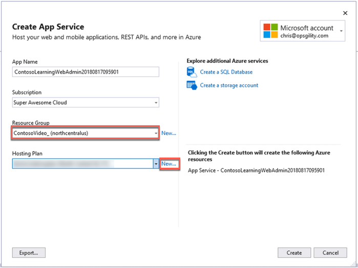

4.  On the **Configure Hosting Plan** dialog, enter a valid name into the **Hosting Plan** name field, then select the **Location** that you used previously for this lab, then choose **OK**.

    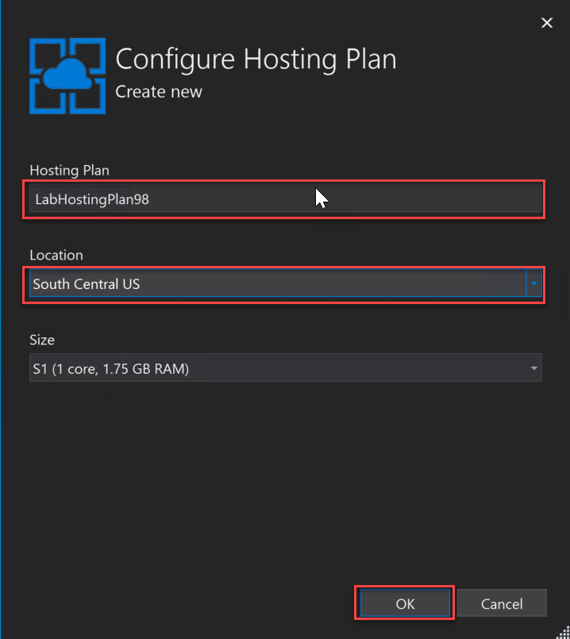

5.  Choose **Create**.

    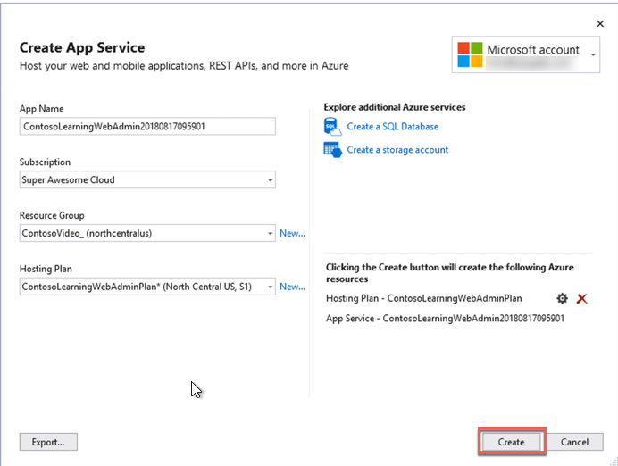

6.  Once the application has finished deploying to the Azure Web App, a new browser window will be opened and navigated to the web app running in Azure.

7.  You should now have an Error screen for the app. This is normal since the AppSettings haven't been configured yet.
 
    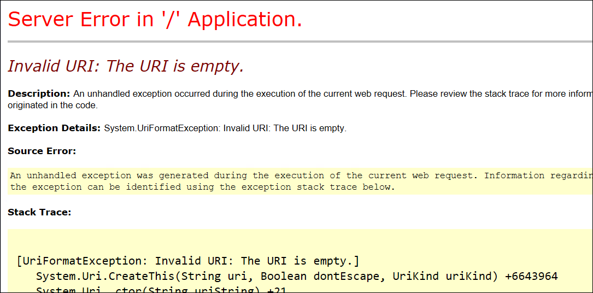

### Task 6: Configure application settings

1.  Open the Azure Portal, select **Resource groups** in the menu, then choose the **ContosoVideo** Resource Group, then select the **Azure Cosmos DB Account** that was created previously.

    

2.  On the **Azure Cosmos DB Account** blade, select **Keys**.
 
    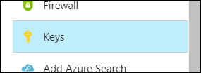
    

3.  Copy the **URI** and **Primary Key** for the Cosmos DB Account for use later.
 
    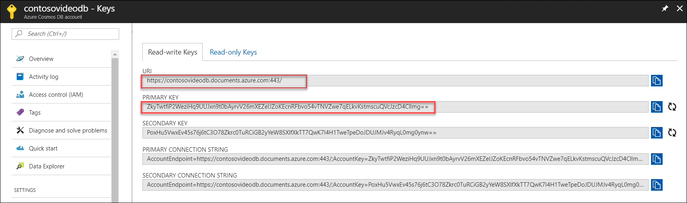

4.  Choose **Resource groups** in the menu, then choose the **ContosoVideo** Resource Group, then choose on the **Storage Account** created in Exercise 2.

    

5.  On the **Storage account** blade, select **Access keys**.

    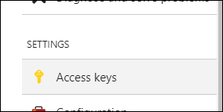

6.  Copy the **Connection String** for **Key 1** for use later.

    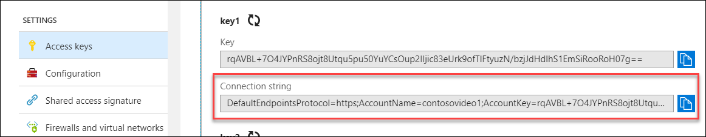

7. Select **Resource groups** in the menu, then choose the **ContosoVideo** Resource Group, then select **Azure Web App**.

    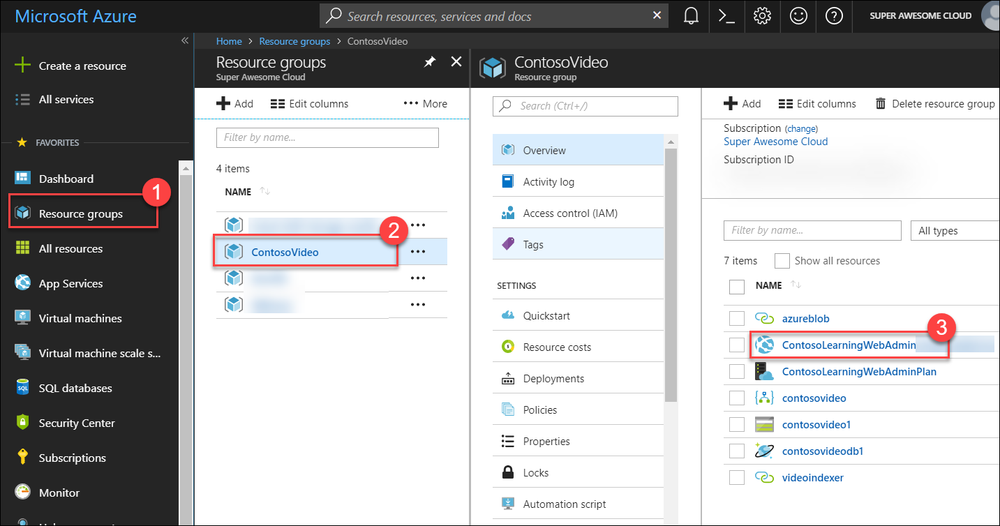

8.  On the **App Service** blade, select **Configuration**.

    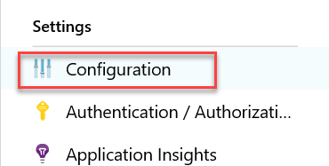

9.  On the **Application settings** pane, scroll down to the **App settings** section.

    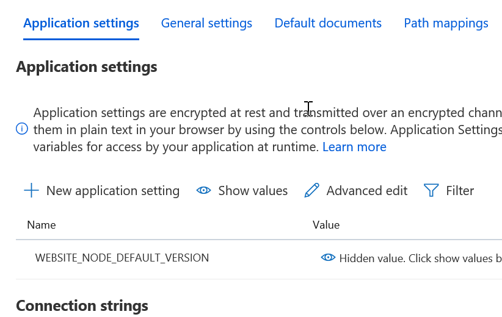

10. Add a new App Setting with the Key of **CosmosDB\_Endpoint** with the Value set to the **Cosmos DB Account URI** that was copied.

    

12. Add a new App Setting with the Key of **CosmosDB\_AuthKey** with the Value set to the **Cosmos DB Account Primary Key** that was copied.

    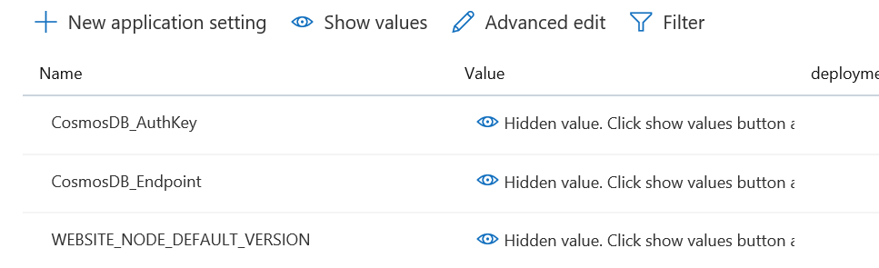

12. Add a new App Setting with the Key of **CosmosDB_Database** with the Value set to **learning**.

    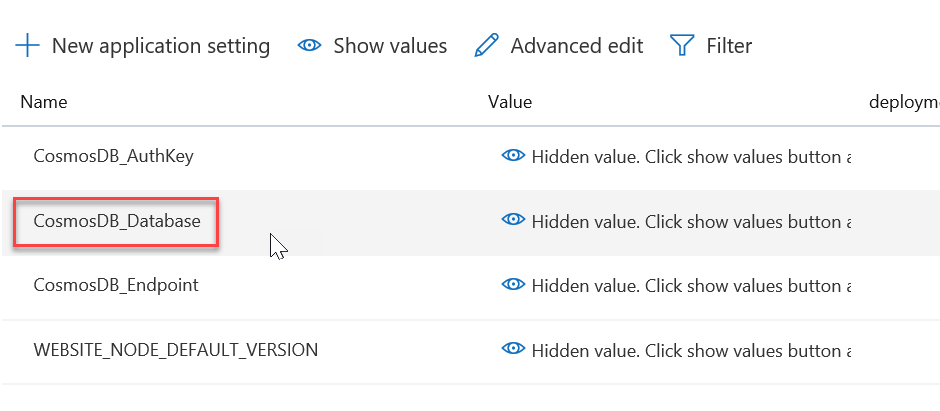

13. Add a new App Setting with the Key of **CosmosDB_Collection** with the Value set to **videos**.

    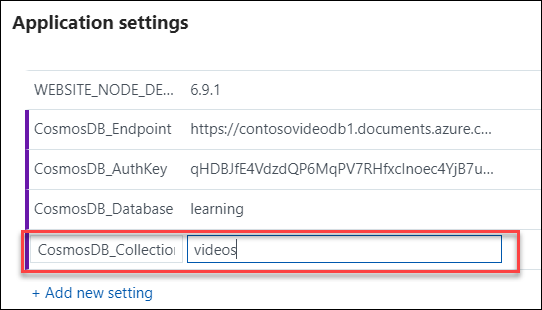

14. Add a new App Setting with the Key of **VideoIndexerAPI\_Key** with the Value set to the **Video Indexer API Key** that was copied previously.
 
    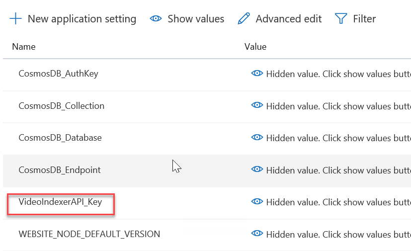

15. Locate the **Connection strings** section and add a new Connection String with the following values:

    - Name: **videostorage**

    - Value: **Paste in the Storage Account connection string copied previously.**

    - Type: **Custom**

    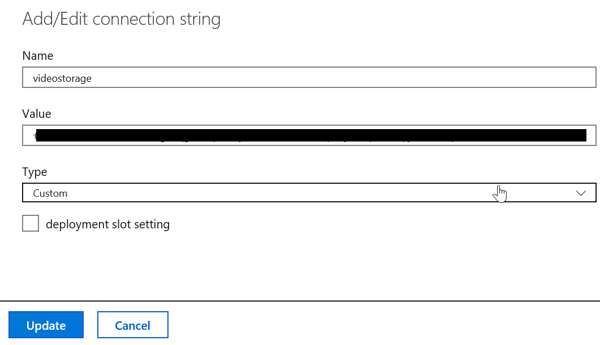

16. Select **Save**.

    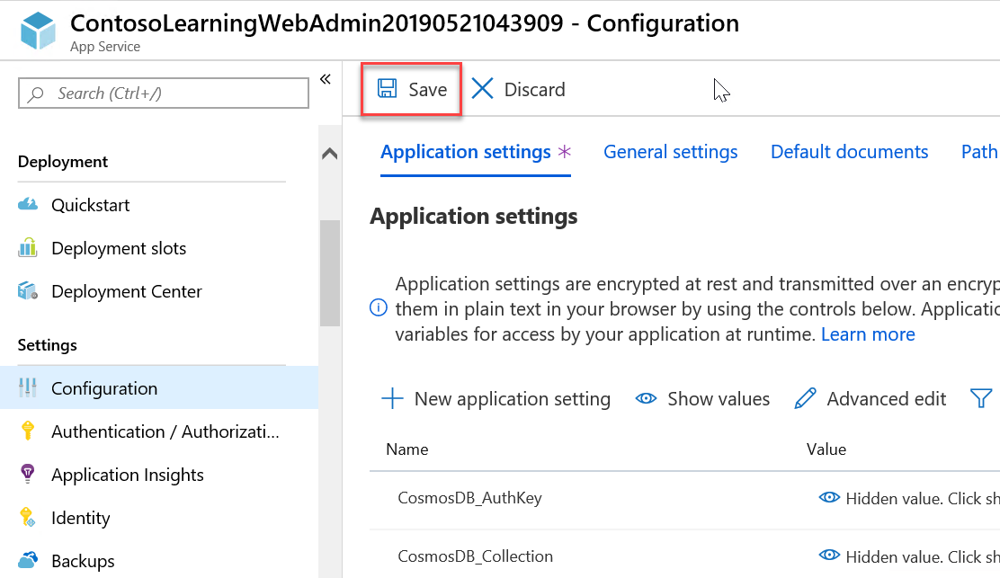

17. Refresh the browser with the admin web app running in it. If you closed it, then open it up again. You will now see that the application is loading without error.

    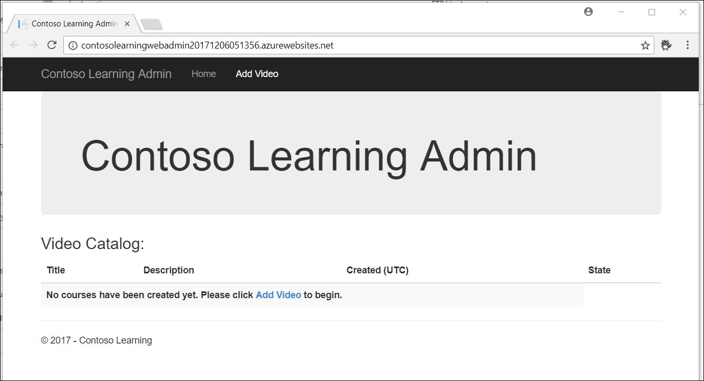

18. **Don't upload a video through the Admin app yet.** We still need to finish setting up the back-end of the application.

## Exercise 4: Update video status when processing is complete

Duration: 20 minutes

In this exercise, you will integrate an Azure Function with the Logic App Workflow so that the Azure Cosmos DB database is updated when a video is finished being processed within Video Indexer.

### Task 1: Create Azure Function

1.  Open **Azure Portal**.

2.  Select the **Create a Resource**, **Compute** then **Function App**
 
    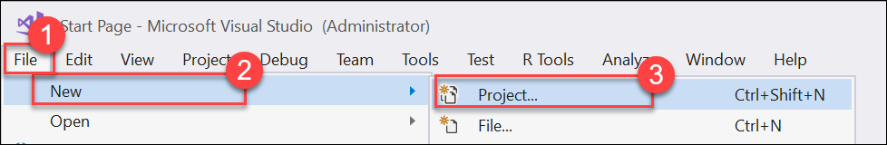

3.  On the **Function App Create** dialog, Fill in the following fields.

    - App Name: **contosovideofunction** 
    - Resource Group: **Use existing** then select **ContosoVideo**
    - Location: Use the **same location** as the other apps.
    - Storage: **Use existing** and select the storage account created earlier in this lab.

    Click **Create**.
 
    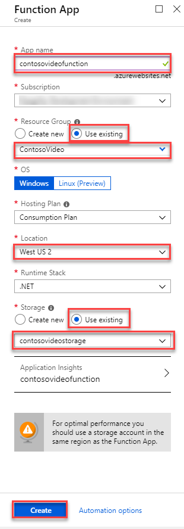

4. Click on  **Resource Groups**, then on **ContosoVideo**, then click the new function app **contosovideofunction** to open the resource.

    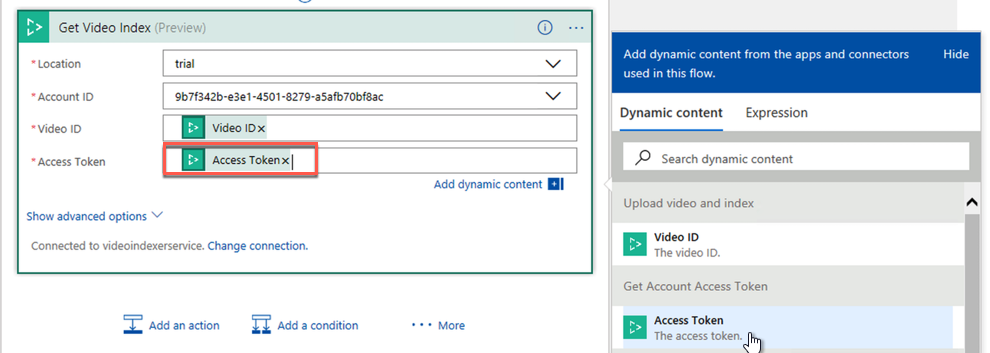

5.  Within the **contosovideofunction** pane, click **Function app settings** to configure the function app.

    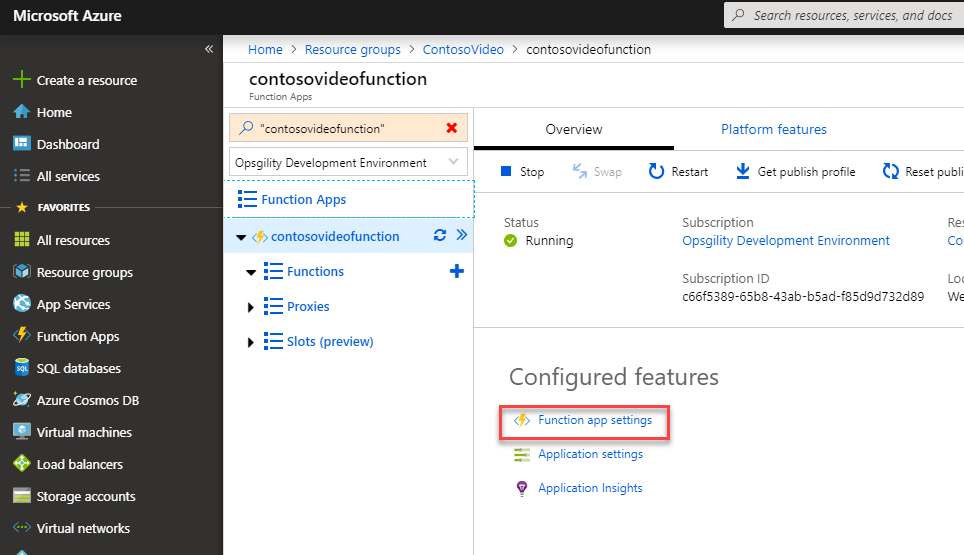

6.  In the **Runtime version** section, select the **~1** option.

    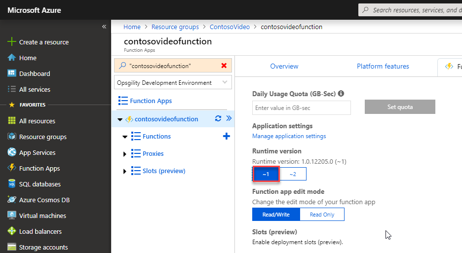

7.  On the same window, click the **+** sign to open the **New Azure Function** dialog.

    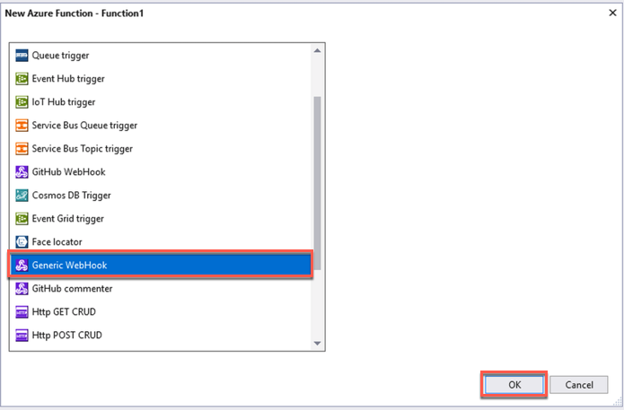

8.  Within the **Get Started** pane, locate and click the **Custom Function** link.

    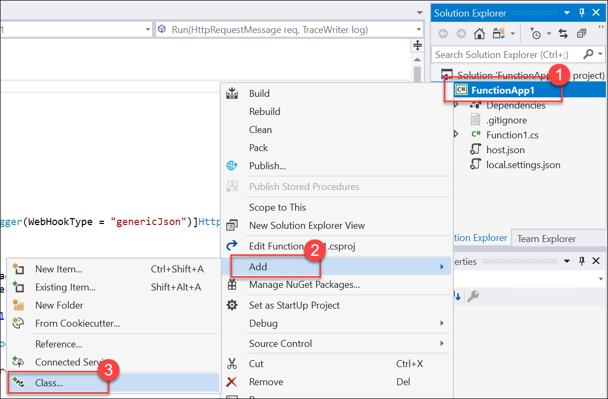

9. In the **Choose a template** pane, locate the **HTTP Trigger** template, click on **C#** to create the template.
 
    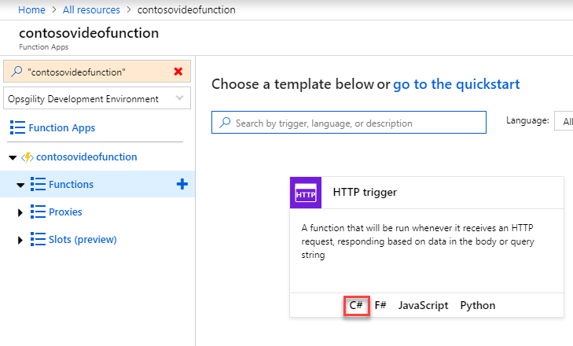

10. In the **HTTP trigger** pane, under **New Function**, Name the function Function1 and click **Create**.
    
    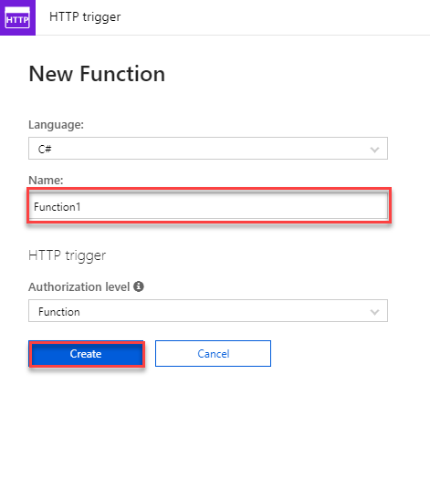

11. In the code for the **Function1**  above the run method, update the using statements to match the code below.

    ```
    #r "Microsoft.Azure.Documents.Client"
    #r "Microsoft.Azure.WebJobs.Extensions.DocumentDB"
    #r "Microsoft.Azure.WebJobs"
    #r "Microsoft.Azure.WebJobs.Host"
    #r "Newtonsoft.Json"

    using System;
    using System.Net;
    using Newtonsoft.Json;
    using System.Threading.Tasks;
    using Microsoft.Azure.WebJobs;
    ```

12. Below the code for the **Run** method, add the class below **Input** with the following two properties:

    ```
    public class Input
    {
        public string documentId { get; set; }
        public string videoId { get; set; }
    }
    ```

13. Save the file.

14. On the right side of the pane select **View files**.
    
    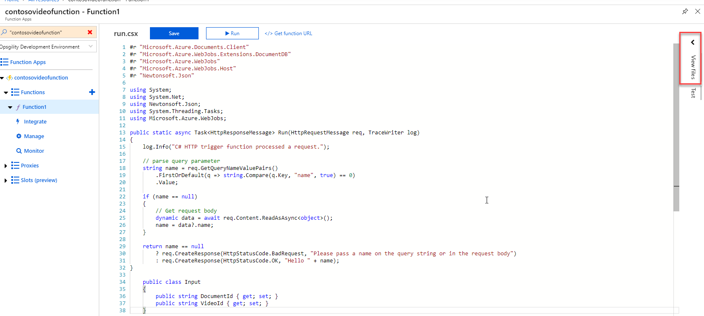
    
15. Select **function.json** to view the bindings.
    
    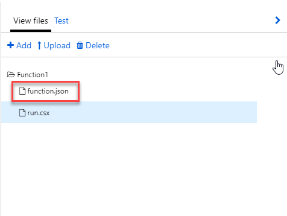

16. In the function.json code add the following section:
    ```
         ,
        {
        "name": "inputDocument",
        "type": "documentDB",
        "id": "tempValue",
        "partitionKey": "tempValue",
        "databaseName": "learning",
        "collectionName": "videos",
        "createIfNotExists": false,
        "connection": "contosovideodb_DOCUMENTDB",
        "direction": "out"
        }
    ```
    The bindings should now look like this:
    ```
        {
        "bindings": [
            {
            "authLevel": "function",
            "name": "req",
            "type": "httpTrigger",
            "direction": "in",
            "methods": [
                "get",
                "post"
            ]
            },
            {
            "name": "$return",
            "type": "http",
            "direction": "out"
            },
            {
            "name": "inputDocument",
            "type": "documentDB",
            "id": "tempValue",
            "partitionKey": "tempValue",
            "databaseName": "learning",
            "collectionName": "videos",
            "createIfNotExists": false,
            "connection": "contosovideodb_DOCUMENTDB",
            "direction": "out"
            }
        ],
        "disabled": false
        }
    ```
17. Save the file.

18. Click the **run.csx** file to return to the C# code.
    
    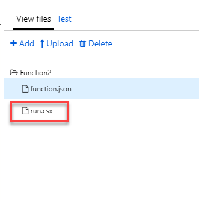

19. Update signature of the **Run** method to contain a **binder** parameter of type **Binder**. This also adds the **DocumentDb** attributes to the binding we just added in the **JSON** file. **Binding** will allow the Azure Function to bind the DocumentDb document with incoming values and update the status of the process from Video Indexer.

    >**Note**: The first 2 parameters of the **DocumentDB** attribute define to connect to the "*videos*" Cosmos DB Collection within the "*learning*" database. And the value of "*{documentId}*" will enable it to retrieve the Document whose ID is set to the same value of the "*documentId*" value passed into the method via the HTTP call. The "*ConnectionStringSetting"* parameter sets the name of the App Setting that will store the Cosmos DB Connection String.
    
    ```
    public static async Task<object> Run(Binder binder,
        HttpRequestMessage req,
        [DocumentDB(databaseName: "learning", collectionName: "videos", Id = "{documentId}", PartitionKey = "{documentId}", ConnectionStringSetting = "contosovideodb_DOCUMENTDB")]  dynamic inputDocument,
        TraceWriter log)
    ```

20. Add the code to get the query string values and bind the incoming values to the DocumentDb document **inputDocument** and to save the **input.VideoId** indexer id to the document.

    ```
        Input input = new Input
    {
        DocumentId = req.GetQueryNameValuePairs().FirstOrDefault(q => string.Compare(q.Key, "documentId", true) == 0).Value,
        VideoId = req.GetQueryNameValuePairs().FirstOrDefault(q => string.Compare(q.Key, "videoId", true) == 0).Value
    };
        inputDocument = await binder.BindAsync<Object>(new DocumentDBAttribute("learning", "videos")
    {
        ConnectionStringSetting = "contosovideodb_DOCUMENTDB",
        Id = input.DocumentId,
        PartitionKey = input.DocumentId
    });
        // Save the Video Indexer 'videoId' to the Cosmos DB Document
        inputDocument.videoId = input.VideoId;
    ```
21. Replace the return code of the **Run** method with the following code that checks the necessary parameters are passed in to the method:

    ```
        log.Info("Function triggered...");

        // Log the parameters passed in through the Request Body
        log.Info($"DocumentId: {input.documentId}");
        log.Info($"VideoId: {input.videoId}");

        if (string.IsNullOrEmpty(input.videoId) || string.IsNullOrEmpty(input.documentId))
        {
            log.Error("DocumentId and/or VideoId parameter missing!");
            return req.CreateResponse(HttpStatusCode.BadRequest, $"Please pass a 'videoId' and 'documentId' in the Http request body");
        }
        return req.CreateResponse(HttpStatusCode.OK, "Success");
    ```

22. Add a helper model class **VideoProcessingState** to get the values from the **Video Indexer** at the very end of the file.
    ```
    public class VideoProcessingState
    {
        public string state { get; set; }

        public string ErrorType { get; set; }

        public string Message {get; set;}

        public videostate[] videos { get; set; }

        public class videostate
        {
            public string processingProgress { get; set; }
        }
    }
    ``` 
23. Add a method that uses the VideoProcessingState class and connects to **Video Indexer** just below the **Run** method's ending bracket.

    ```
    private static async Task<VideoProcessingState> GetVideoProcessingState(string videoId, TraceWriter log)
    {
        var client = new HttpClient();

        // Request headers
        string subscriptionKey = Environment.GetEnvironmentVariable("VideoIndexerAPI_Key");//System.Configuration.ConfigurationManager.AppSettings["VideoIndexerAPI_Key"];
           log.Info($"Video Index API Keys: {subscriptionKey}");
        client.DefaultRequestHeaders.Add("Ocp-Apim-Subscription-Key", subscriptionKey);

        // Get Video Indexer Account ID
        var uriAccountsResponse = await client.GetAsync("https://api.videoindexer.ai/auth/trial/Accounts?generateAccessTokens=true&allowEdit=true");
        var jsonUriAccountsResponse = await uriAccountsResponse.Content.ReadAsStringAsync();
        dynamic accounts = Newtonsoft.Json.Linq.JArray.Parse(jsonUriAccountsResponse);
        var videoIndexerAccountId = accounts[0].id;
        var accessToken = accounts[0].accessToken;

        //Get Video Index
        client.DefaultRequestHeaders.Add("Ocp-Apim-Subscription-Key", subscriptionKey);
        var uri = $"https://api.videoindexer.ai/trial/Accounts/{videoIndexerAccountId}/Videos/{videoId}/Index?accessToken={accessToken}";

        var response = await client.GetAsync(uri);

        var content = await response.Content.ReadAsStringAsync();

        log.Info($"Processing State JSON: {content}");

        return JsonConvert.DeserializeObject<VideoProcessingState>(content);
    }
    ```
24. The resulting **run.csx** file should have the following code:

    ```
    #r "Microsoft.Azure.Documents.Client"
    #r "Microsoft.Azure.WebJobs.Extensions.DocumentDB"
    #r "Microsoft.Azure.WebJobs"
    #r "Microsoft.Azure.WebJobs.Host"
    #r "Newtonsoft.Json"

    using System;
    using System.Net;
    using Newtonsoft.Json;
    using System.Threading.Tasks;
    using Microsoft.Azure.WebJobs;

    [FunctionName("Function1")]
    public static async Task<object> Run(Binder binder,
        HttpRequestMessage req,
        [DocumentDB(databaseName: "learning", collectionName: "videos", Id = "{documentId}", PartitionKey = "{documentId}", ConnectionStringSetting = "contosovideodb_DOCUMENTDB")]  dynamic inputDocument,
        TraceWriter log)    
    {
    // get query string values
    Input input = new Input
    {
        DocumentId = req.GetQueryNameValuePairs().FirstOrDefault(q => string.Compare(q.Key, "documentId", true) == 0).Value,
        VideoId = req.GetQueryNameValuePairs().FirstOrDefault(q => string.Compare(q.Key, "videoId", true) == 0).Value
    };

    // Bind attributes to DocumentDb
    inputDocument = await binder.BindAsync<Object>(new DocumentDBAttribute("learning", "videos")
    {
        ConnectionStringSetting = "contosovideodb_DOCUMENTDB",
        Id = input.DocumentId,
        PartitionKey = input.DocumentId
    });


    // Save the Video Indexer 'videoId' to the Cosmos DB Document
    inputDocument.videoId = input.VideoId;

    // Load Video Processing State
    dynamic processingState = await GetVideoProcessingState(input.VideoId, log);

            log.Info($"Video Processing State: {processingState.state}");
            log.Info($"Video Processing Progress: {processingState.videos[0].processingProgress}");

            // Save Video Processing State in Cosmos DB Document
            inputDocument.processingState = processingState.state;
            inputDocument.processingProgress = processingState.videos[0].processingProgress;

            log.Info("Function triggered...");

        // Log the parameters passed in through the Request Body
        log.Info($"DocumentId: {input.DocumentId}");
        log.Info($"VideoId: {input.VideoId}");

        if (string.IsNullOrEmpty(input.VideoId) || string.IsNullOrEmpty(input.DocumentId))
        {
            log.Error("DocumentId and/or VideoId parameter missing!");
            return req.CreateResponse(HttpStatusCode.BadRequest, $"Please pass a 'videoId' and 'documentId' in the Http request body");
        }
        return req.CreateResponse(HttpStatusCode.OK, "Success");
    }
    private static async Task<VideoProcessingState> GetVideoProcessingState(string videoId, TraceWriter log)
    {
        var client = new HttpClient();

        // Request headers
        string subscriptionKey = Environment.GetEnvironmentVariable("VideoIndexerAPI_Key");//System.Configuration.ConfigurationManager.AppSettings["VideoIndexerAPI_Key"];
           log.Info($"Video Index API Keys: {subscriptionKey}");
        client.DefaultRequestHeaders.Add("Ocp-Apim-Subscription-Key", subscriptionKey);

        // Get Video Indexer Account ID
        var uriAccountsResponse = await client.GetAsync("https://api.videoindexer.ai/auth/trial/Accounts?generateAccessTokens=true&allowEdit=true");
        var jsonUriAccountsResponse = await uriAccountsResponse.Content.ReadAsStringAsync();
        dynamic accounts = Newtonsoft.Json.Linq.JArray.Parse(jsonUriAccountsResponse);
        var videoIndexerAccountId = accounts[0].id;
        var accessToken = accounts[0].accessToken;

        //Get Video Index
        client.DefaultRequestHeaders.Add("Ocp-Apim-Subscription-Key", subscriptionKey);
        var uri = $"https://api.videoindexer.ai/trial/Accounts/{videoIndexerAccountId}/Videos/{videoId}/Index?accessToken={accessToken}";

        var response = await client.GetAsync(uri);

        var content = await response.Content.ReadAsStringAsync();

        log.Info($"Processing State JSON: {content}");

            return JsonConvert.DeserializeObject<VideoProcessingState>(content);
       }

    public class Input
    {
        public string DocumentId { get; set; }
        public string VideoId { get; set; }
    }
    
    public class VideoProcessingState
    {
        public string state { get; set; }

        public string ErrorType { get; set; }

        public string Message {get; set;}

        public videostate[] videos { get; set; }

        public class videostate
        {
            public string processingProgress { get; set; }
        }
    }
    ```
25. Save the changes.

26. Open the **Azure Portal** and navigate to the **Cosmos DB Account** that was previously created.

27. On the **Cosmos DB Account** blade, choose **Keys**.

    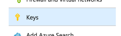

28. Copy the **PRIMARY CONNECTION STRING** for the Cosmos DB Account.

    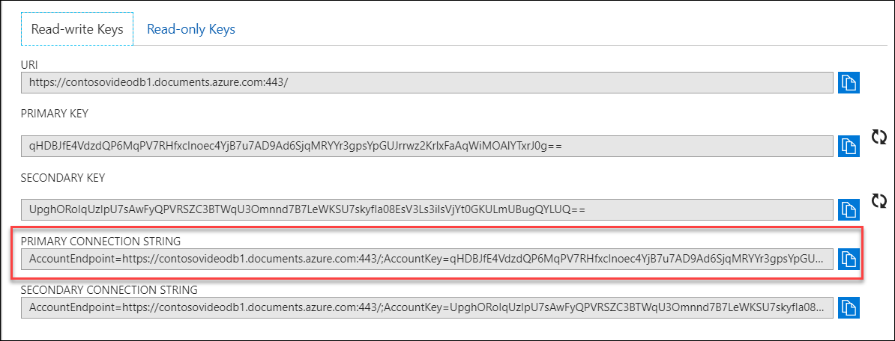

29. Navigate to the **ContosoVideo** Resource Group, then navigate to the **Azure Function** that was created and published from Visual Studio.

    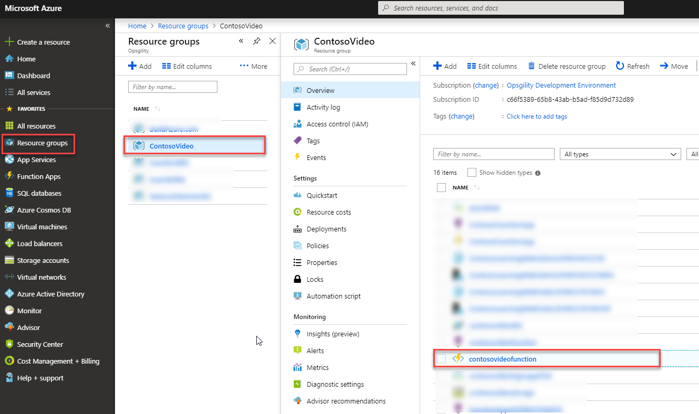

30. On the **Azure Function** blade, choose **Configuration** under the Configured features section.

    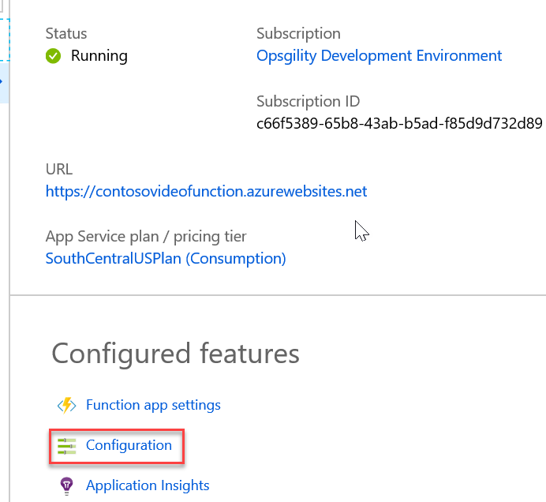

31. Scroll down and add a new **Application setting** with the following values:

    - Name: **contosovideodb\_DOCUMENTDB**

    - Value: **Paste in the Cosmos DB Account Connection String that was copied**.

    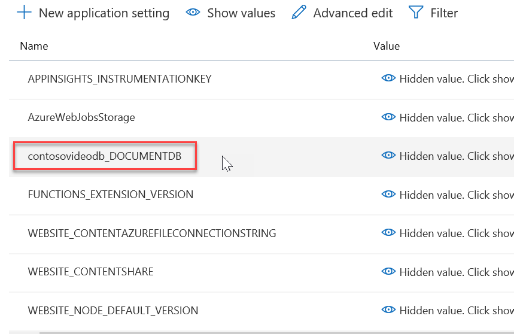

32. Add another **Application setting** with the following values:

    - Name: **VideoIndexerAPI\_Key**

    - Value: **Paste in the Video Indexer API Key that was copied previously**.

    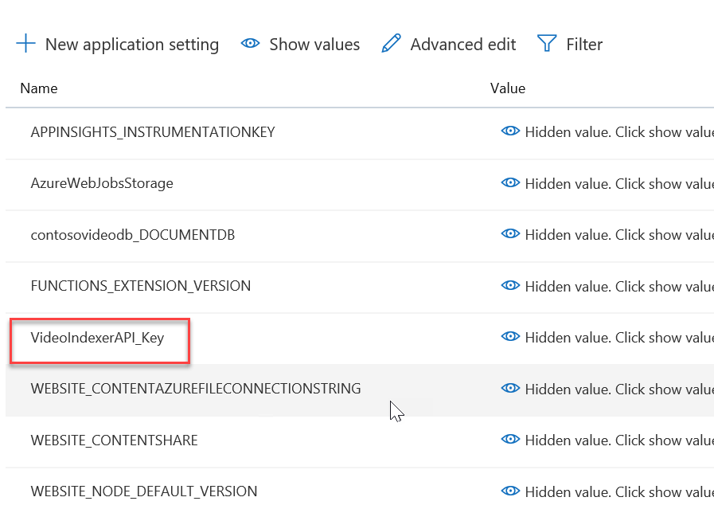

33. Go back up and select **Save**.

    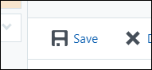

### Task 2: Update Video State when processing is complete

1. Open the **Logic App Designer** within the Azure Portal for the Logic App that was previously created.

2. Locate the end of the Workflow, after the **Video Indexer -- Upload video and index** action.

    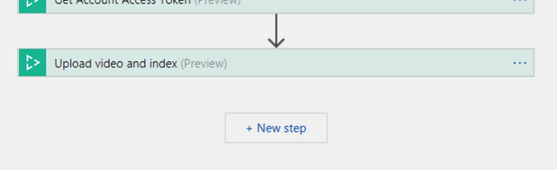

3. Select **+New step**

    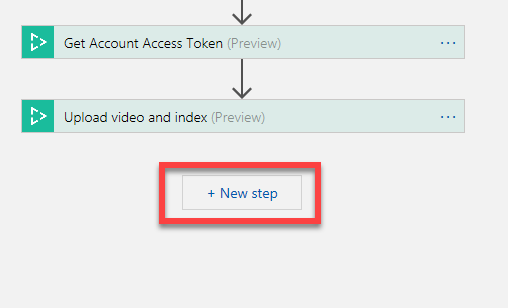

4. Search for and select the **Until** under the **Control** category of actions. This will be used to periodically check the video processing state and wait until it's finished before moving on with the workflow.

    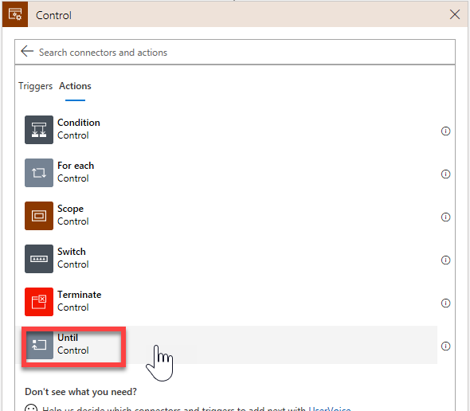

5. Within the **Until** action, choose the **Add an action** link to add an action within the "until" block.

    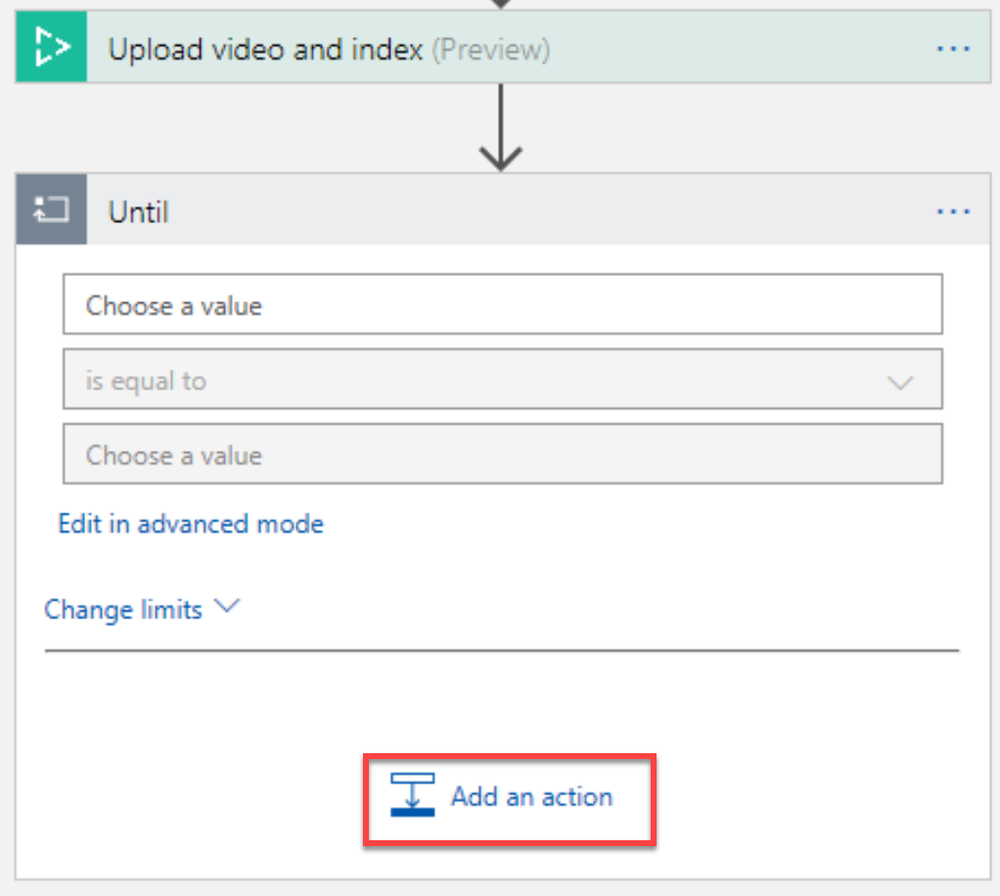

6. Search for and add a **Video Indexer -- Get Video Index** action.

    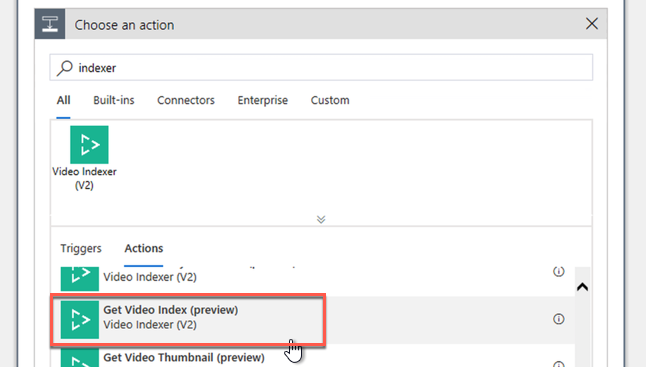

7. On the **Get Video Index** action, enter the following values:

    - Location: **trial**
    - Account ID: **Select your Video Indexer Account ID**.
    - Video ID: Select the **Video ID** value from the **Upload video and index** action.

    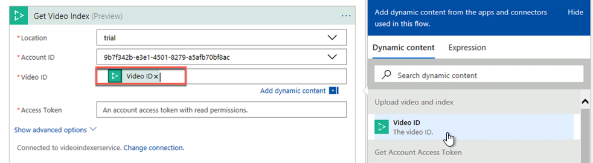

    - Access Token: select the **Access Token** value from the **Get Account Access Token** action.

    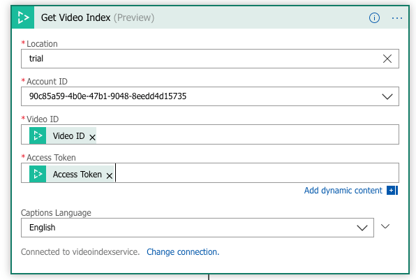

8. At the top of the **Until** action, set the check condition to look at the **State** parameter from the **Get Video Index** action and compare that it **is equal to** the value of **Processed**.

    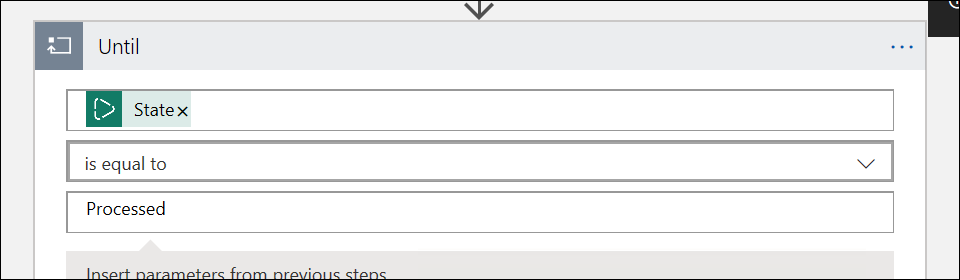

    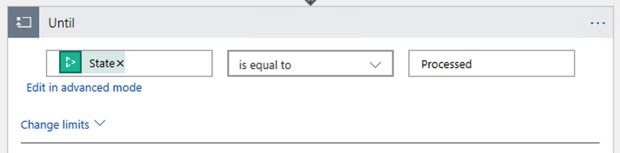

9. Choose **Add an action** to add another action within the **Until** action, after the **Get processing state** action.

    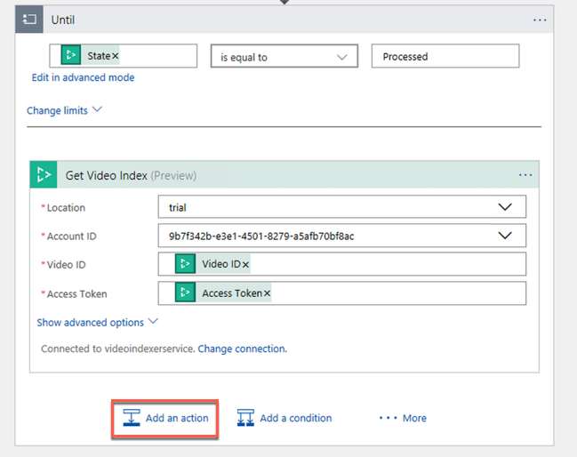

    > **Note**: The Processing State is being polled here so it can easily be added to the database so the percentage complete can be displayed to the end-user within the web app more easily. Without this feature, the best practice would be to configure a callback with the initial Video Indexer call, so it can asynchronously notify when processing is completed.

10. Select the **Choose an Azure function** action of the **Azure Functions** Connector.

    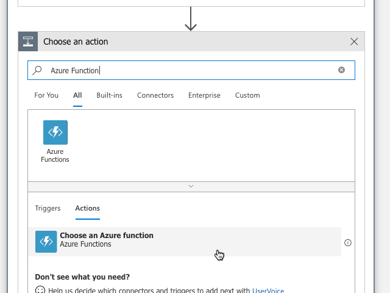

11. For the Azure Functions action, select the **Azure Function** name that was created previously.

    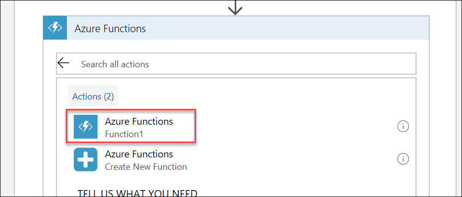

12. Update the **Request Body** field for the Azure Functions Action to contain a JSON object that includes **documentId** and **videoId** values.

    ```
    {"documentId": "", "videoId": "" }
    ```

    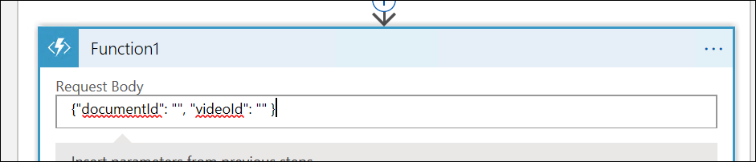

13. Modify the JSON properties to have the following values. Also, be sure to remove the empty double quotes `""` from the JSON when adding the new property values as shown below.

    - Set the **documentId** property to the **List of Files Name** parameter from the **Blob Storage -- When one or more blobs are added or modified (metadata only)** action.

    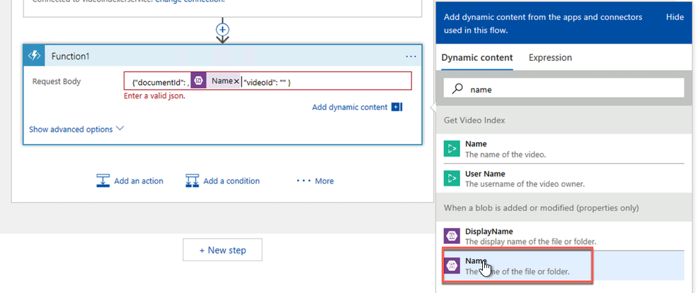

    - Set the **videoId** property to the **Video Id** parameter from the **Video Indexer -- Upload and index (using a URL)** action.

    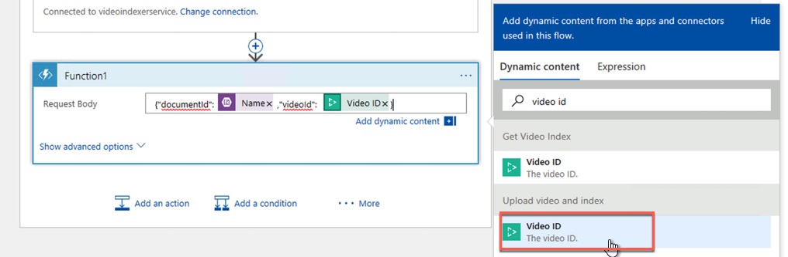

14. Choose **Add an action** to add another action within the **Until** action, after the Azure Functions Action.

    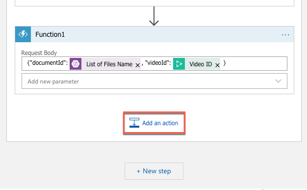

15. Search for **delay** and select the **Schedule** action.

    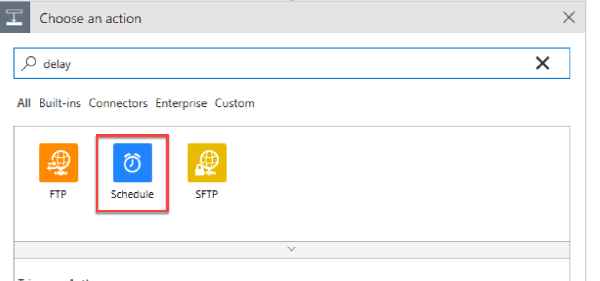

16. Search for and add a **Schedule -- Delay** action.

    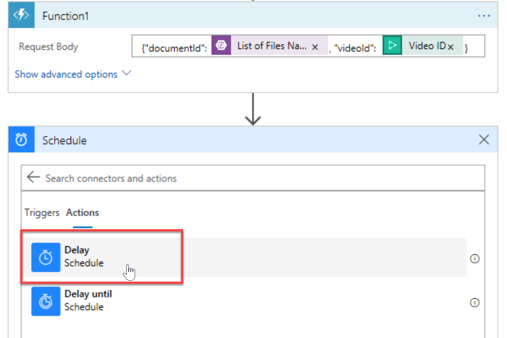

17. On the **Delay** action, enter the following values:

    - Count: **30**

    - Unit: **Second**

    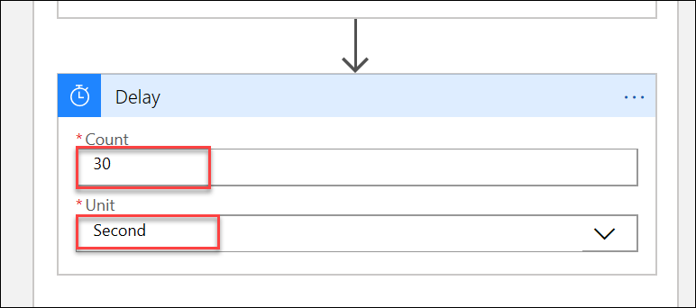

18. Scroll down to the bottom or end of the Logic App Workflow and choose **+New step**.
    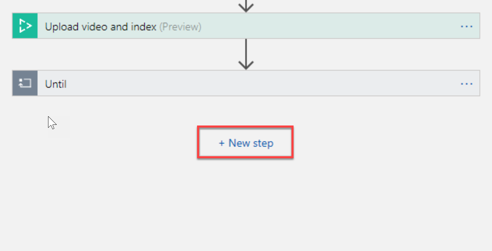

19. Choose the **Azure Functions Action**, then select the previous function here that is configured identical to the one previously created within the **Until** loop action. The reason for this is the first one within the **Until** action will periodically update the status of the Video Processing within the Cosmos DB document with each iteration of the loop. This new Azure Function at the end of the Logic App Workflow will update the Video Processing State one final time before the Workflow finished execution.

    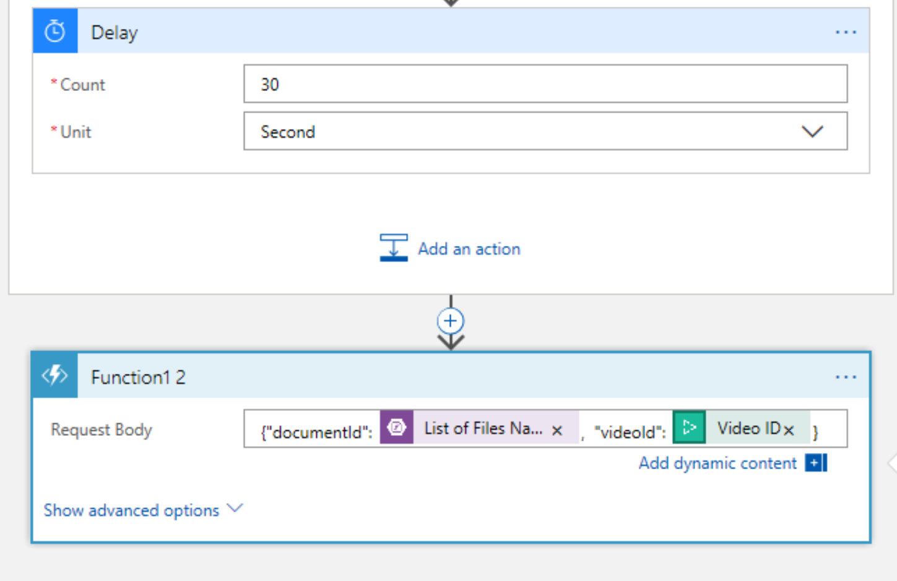

20. **Save** the Logic App.

21. Click **Run** to run the Logic App.

## Exercise 5: Add video player to front-end application

Duration: 30 minutes

In this exercise, you will extend the Front-End Application foundation to include a video player and Cognitive Services Insights for the Videos.

### Task 1: Integrate Cosmos DB into front-end application

1.  Open the **ContosoLearning.sln** solution within Visual Studio 2019.

2.  Within Solution Explorer, locate and expand the **ContosoLearning.Web.Public** project, then expand the **Controllers** folder and open the **HomeController.cs** file.

    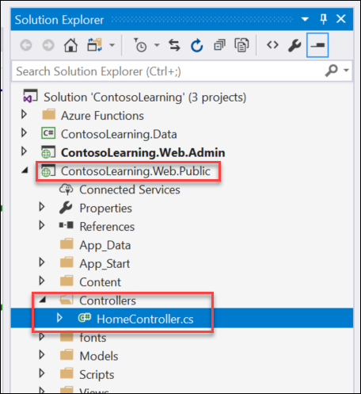

3.  Within the **HomeController** class, locate the **Index()** Action method and replace the methods contents with the following code that uses the **VideoRepository** to load all the Videos from the Cosmos DB Collection and returns the data in the Model so the view can display it in the UI.

    ```
    var model = new HomeIndexModel();

    var videoRepo = VideoRepositoryFactory.Create();

    model.Videos = (from v in await videoRepo.GetAll()
                        orderby v.Title, v.Created
                        select new VideoListModel
                        {
                            Video = v
                        }).ToArray();

    return View(model);
    ```

4.  Locate the **Video(string id)** method. This Action method is used to display the video player for individual videos. Replace the contents of this method with the following code that loads the Video info from the Cosmos DB Collection.

    ```
    var model = new HomeVideoModel();

    var courseRepo = VideoRepositoryFactory.Create();
    model.Video = await courseRepo.Get(id);

    if (model.Video == null)
    {
        throw new Exception("Video not found!");
    }

    // Get Access Token
    var client = new System.Net.Http.HttpClient();
    client.DefaultRequestHeaders.Add("Ocp-Apim-Subscription-Key", System.Configuration.ConfigurationManager.AppSettings["VideoIndexerAPI_Key"]);

    var uriAccountsResponse = await client.GetAsync("https://api.videoindexer.ai/auth/trial/Accounts");
    var jsonUriAccountsResponse = await uriAccountsResponse.Content.ReadAsStringAsync();
    dynamic accounts = Newtonsoft.Json.Linq.JArray.Parse(jsonUriAccountsResponse);
    var videoIndexerAccountId = accounts[0].id;
    model.AccountId = videoIndexerAccountId.ToString();

    var uriResponse = await client.GetAsync($"https://api.videoindexer.ai/auth/trial/Accounts/{videoIndexerAccountId}/Videos/{model.Video.VideoId}/AccessToken");
    var jsonUriResponse = await uriResponse.Content.ReadAsStringAsync();

    model.AccessToken = jsonUriResponse.Replace("\"", string.Empty);

    return View(model);
    ```

5.  **Save** the file.

### Task 2: Display video thumbnail image

1.  Within Solution Explorer, expand the **Controllers** folder within the **ContosoLearning.Web.Public** project, then open the **HomeController.cs** file.

    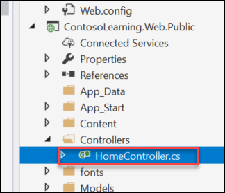

2.  Locate the **Index()** action method within the **HomeController** class.

3.  Paste in the following code immediately before the **return** statement in the **Index()** method. This code will loop through all the Videos and load the **Video Thumbnail URL** for each by calling the **Video Indexer API**.

    ```
    var client = new System.Net.Http.HttpClient();

    // Request headers
    client.DefaultRequestHeaders.Add("Ocp-Apim-Subscription-Key", System.Configuration.ConfigurationManager.AppSettings["VideoIndexerAPI_Key"]);

    // Get Video Indexer Account ID
    var uriAccountsResponse = await client.GetAsync("https://api.videoindexer.ai/auth/trial/Accounts");
    var jsonUriAccountsResponse = await uriAccountsResponse.Content.ReadAsStringAsync();

    dynamic accounts = Newtonsoft.Json.Linq.JArray.Parse(jsonUriAccountsResponse);
    var videoIndexerAccountId = accounts[0].id;


    foreach (var v in model.Videos)
    {
        client.DefaultRequestHeaders.Add("Ocp-Apim-Subscription-Key", System.Configuration.ConfigurationManager.AppSettings["VideoIndexerAPI_Key"]);
        // Get Video Indexer Access Token
        var uriResponse = await client.GetAsync($"https://api.videoindexer.ai/auth/trial/Accounts/{videoIndexerAccountId}/Videos/{v.Video.VideoId}/AccessToken");
        var jsonUriResponse = await uriResponse.Content.ReadAsStringAsync();
        var accessToken = jsonUriResponse.Replace("\"", string.Empty);

        var uri = $"https://api.videoindexer.ai/trial/Accounts/{videoIndexerAccountId}/Videos/{v.Video.VideoId}/Index?accessToken={accessToken}";
        var response = await client.GetAsync(uri);
        var json = await response.Content.ReadAsStringAsync();

        dynamic breakdown = Newtonsoft.Json.Linq.JObject.Parse(json);

        var thumbnailId = breakdown?.summarizedInsights?.thumbnailId;
        v.ThumbnailUrl = $"https://api.videoindexer.ai/trial/Accounts/{videoIndexerAccountId}/Videos/{v.Video.VideoId}/Thumbnails/{thumbnailId}?accessToken={accessToken}&format=Jpeg";
    }
    ```

### Task 3: Add video player

1.  Within Solution Explorer, locate and expand the **Views/Home** folder within the **ContosoLearning.Web.Public** project and open the **Video.cshtml** file.

    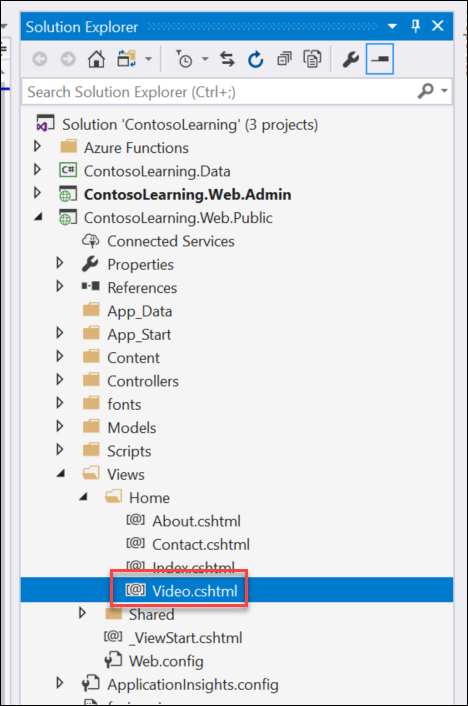

2.  Locate the `[Video Here]` placeholder text within the **Video.cshtml** view.

    ![The "\[Video Here\]" placeholder text is visible in the Video.cshtml file.](images/Hands-onlabstep-by-step-MediaAIimages/media/image151.png "Find the placeholder text")

3.  Replace the placeholder text with the following code that will include the **Video Player** within an IFrame. Notice the **VideoId** property from the Video is appended to the URL within the IFrame to tell Video Indexer which video to play.

    ```
    <iframe width="560" height="315" src="https://www.videoindexer.ai/embed/player/@(Model.AccountId)/@(Model.Video.VideoId)?accessToken=@(Model.AccessToken)" frameborder="0" allowfullscreen></iframe>
    ```

### Task 4: Add video insights

1.  Within the **Video.cshtml** file, locate the `[Insights Here]` placeholder text.

    ![The "\[Insights Here\]" placeholder text is visible in the Video.cshtml file.](images/Hands-onlabstep-by-step-MediaAIimages/media/image152.png "Find the placeholder text")

2.  Replace the placeholder text with the following code that will include the **Video** **Insights** within an IFrame. Notice the **VideoId** property from the Video is appended to the URL within the IFrame to tell Video Indexer which video to display insights for.

    ```
    <iframe style="width: 100%; height: 60em;" src="https://www.videoindexer.ai/embed/insights/@(Model.AccountId)/@(Model.Video.VideoId)?accessToken=@(Model.AccessToken)" frameborder="0" allowfullscreen="true"></iframe>
    ```

### Task 5: Integrate video player and insights together

1.  As coded previously, the Video Player and Insights will display, but are disconnected.

2.  To connect the Video Player and Insights so the insights can update as the video plays, add the following JavaScript file to the bottom of the **Video.cshtml** View below the IFrame code:

    ```
        <script src="https://breakdown.blob.core.windows.net/public/vb.widgets.mediator.js"></script>
    ```

3.  Save the file.

### Task 6: Deploy public website to an Azure Web App

1.  Within Solution Explorer, right-click the **ContosoLearning.Web.Public** project, then select **Publish...**

    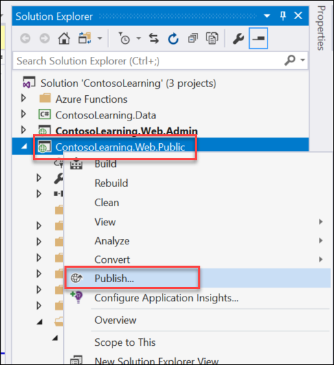

2.  Choose **App Service**, then select the **Create New** radio button, then choose **Publish**.

    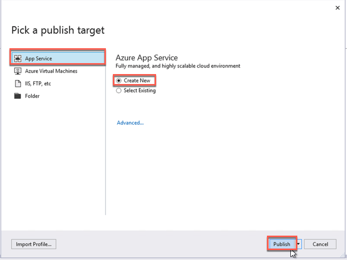

3.  On the **Create New App Service** dialog, select the **ContosoVideo** Resource Group, then select **New** near **Hosting Plan**.

    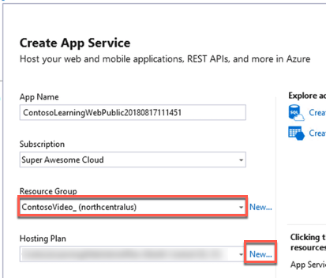

4.  On the **Configure Hosting Plan** dialog, enter a valid name into the **Hosting Plan** name field, then select the **Location** that you used previously for this lab, then select **OK**.

    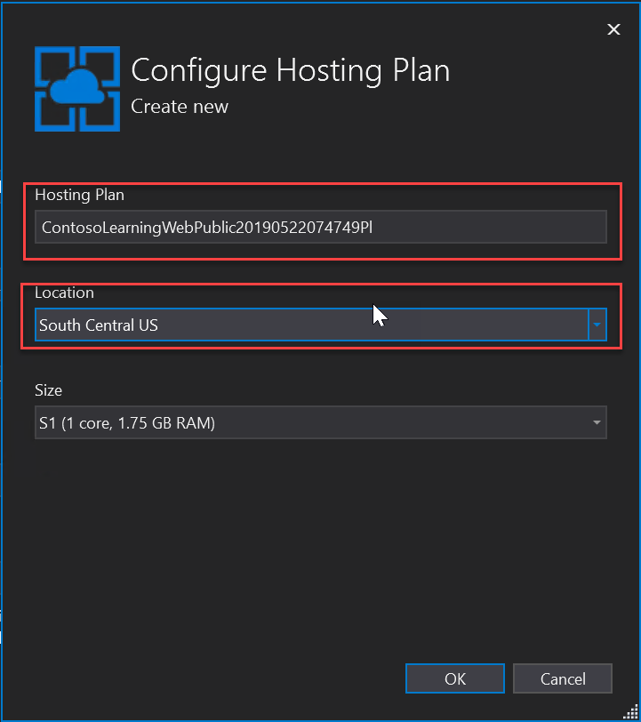

5.  Choose **Create**.

    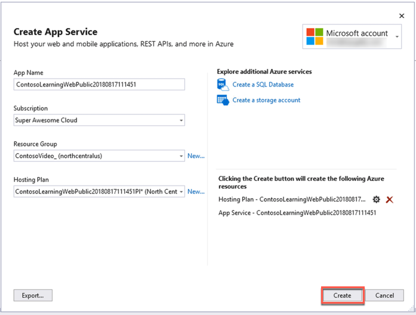

6.  Once the application has finished deploying to the Azure Web App, a new browser window will be opened and navigated to the web app running in Azure.

7.  You should now see an Error screen for the app. This is normal since the AppSettings haven't been configured yet.
 
    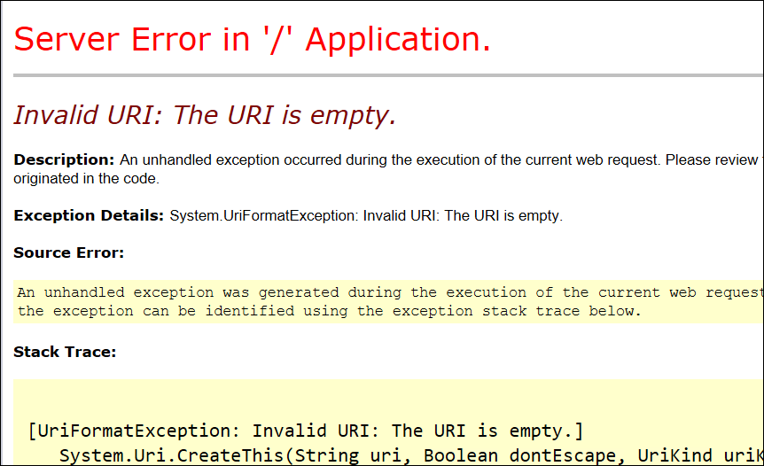

### Task 7: Configure application settings

1.  Open the **Azure Portal**, choose **Resource groups** in the menu, then select the **ContosoVideo** Resource Group, then choose **Azure Web App** that was just created for the Public website.

    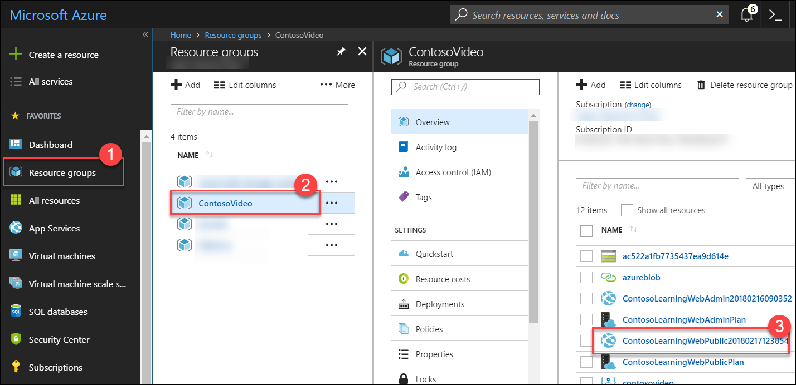

2.  On the **App Service** blade, choose **Configuration**.

    

3.  On the **Application settings** pane, scroll down to the **App settings** section.

    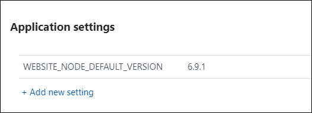

4.  Add a new App Setting with the Name of **CosmosDB\_Endpoint** with the Value set to the **Cosmos DB Account URI** that was copied.

    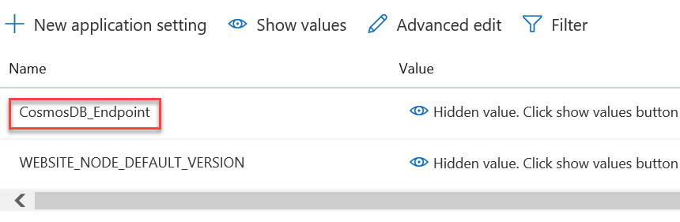

5.  Add a new App Setting with the Name of **CosmosDB\_AuthKey** with the Value set to the **Cosmos DB Account Primary Key** that was copied.

    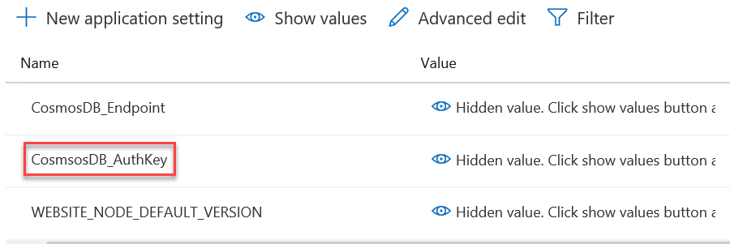

6.  Add a new App Setting with the Key of **CosmosDB\_Database** with the Value set to **learning**.

    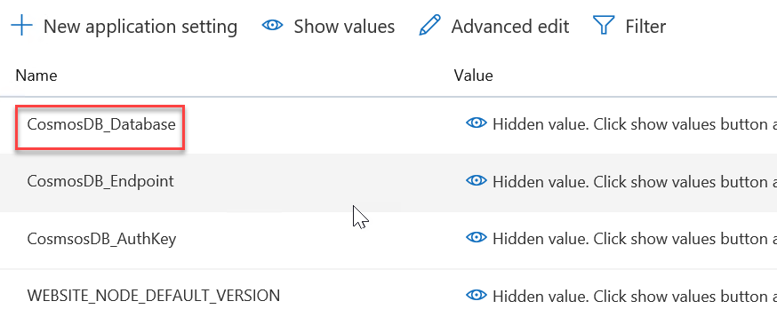

7.  Add a new App Setting with the Key of **CosmosDB\_Collection** with the Value set to **videos**.
  
    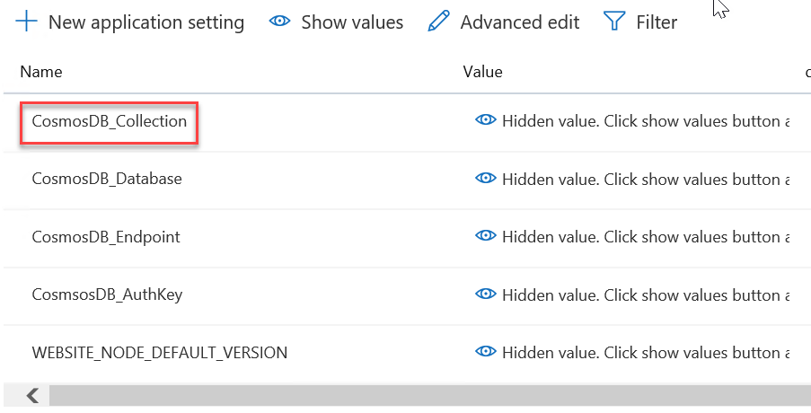

8.  Add a new App Setting with the Key of **VideoIndexerAPI\_Key** with the Value set to the **API Key** for the **Video Indexer API** subscription.
  
    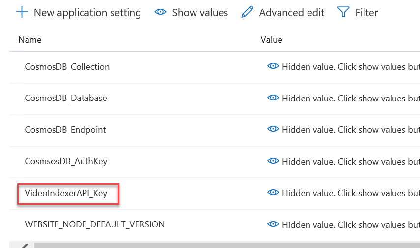

9.  Select **Save**.
 
    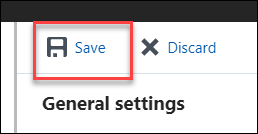
    

## Exercise 6: Test the application

Duration: 15 minutes

In this exercise, you will test out the admin and public web applications.

### Task 1: Upload video to admin website

1.  Open a browser window to the **Admin Website** running in Azure Web Apps. You can use the window that was open previously if it's still open.

    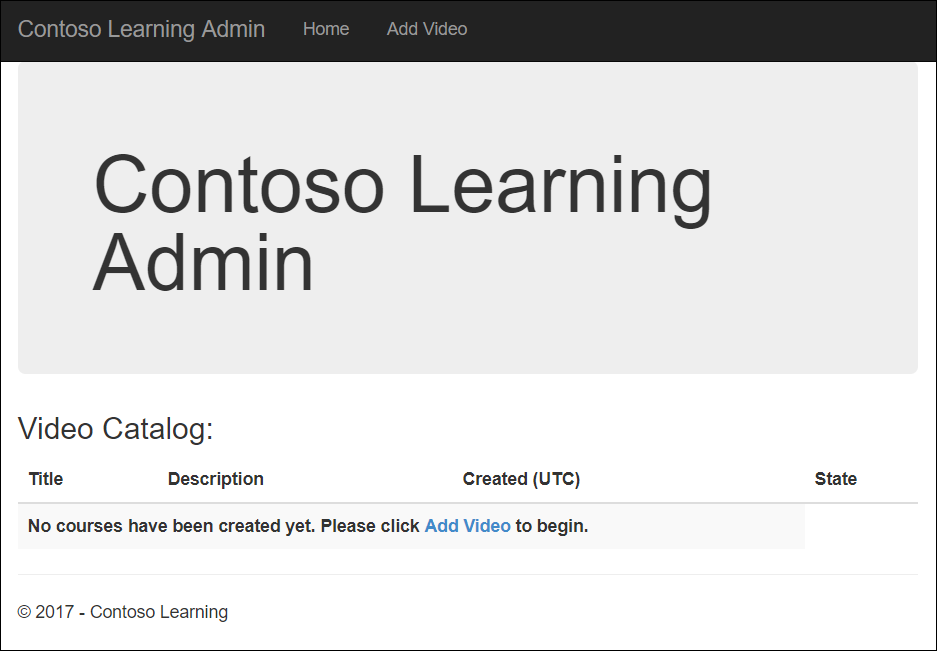

2.  Select the **Add Video** link to begin uploading and adding a new video to the catalog in the application.

    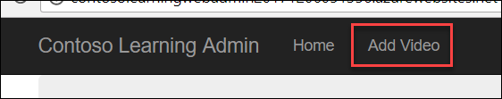

3.  Enter some text into the form for the **Title** and **Description** fields, then choose a **Video** file to upload. Choose the "*Introduction-to-the-Azure-Portal\_mid.mp4*" video file downloaded with the student files for this lab, then select **Upload Video**.

    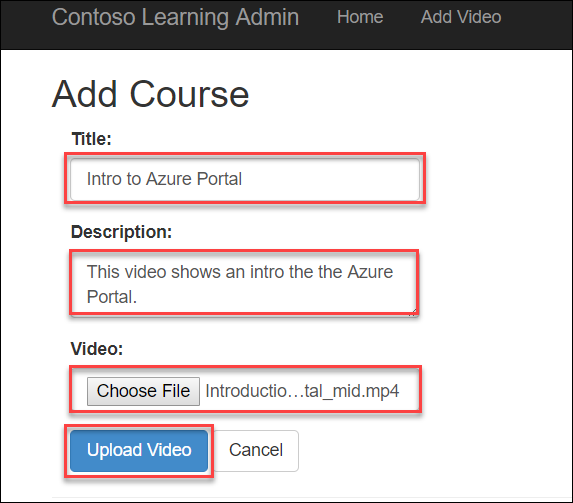

    > **Note**: Uploading the video file may take a few minutes depending on your Internet connection.

4.  Once the video file has been uploaded, the homepage of the admin app will load displaying the Video Processing State and Progress.

    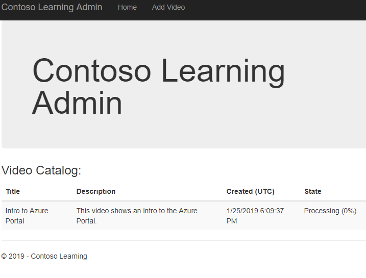

### Task 2: View video and insights in public website

1.  Open a browser window to the **Public Website** running in Azure Web Apps. If using the window previously opened, just refresh the page to reload it.

2.  While the videos are processing within the **Video Indexer** service, the public website will display the Processing State and Progress.

    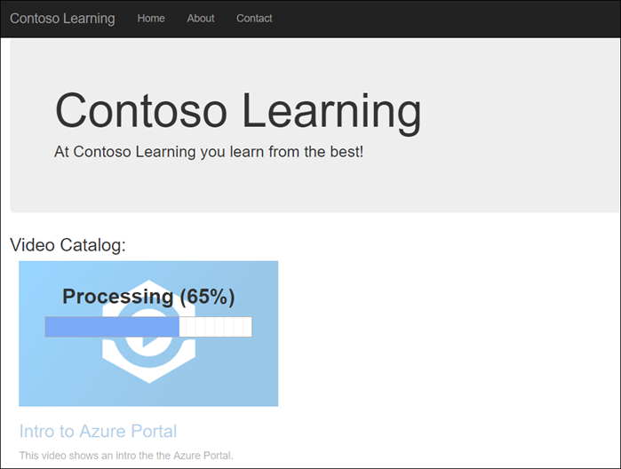

3.  Once the videos have finished processing, select the thumbnail image or the title of the video to view that video.

    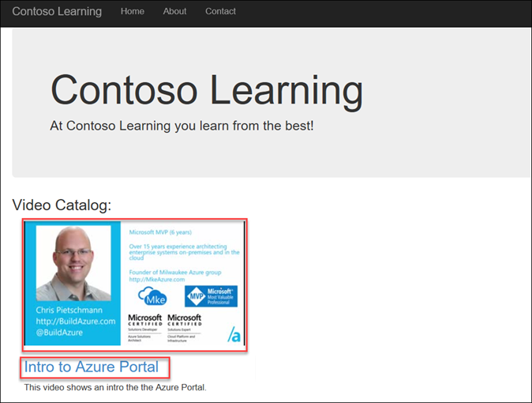

4.  On the video player page, select the **Transcript** tab within the Video Insights. This will show you the transcription of the audio from the video.

    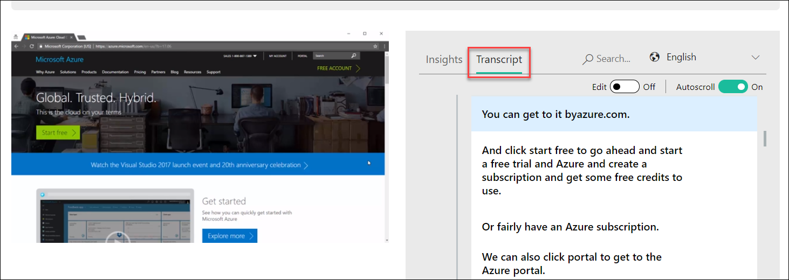

5.  Notice as the video plays through, the transcript highlights and automatically scrolls to reveal the text in the video.

6.  Hover over the **Video Player**, then hover over the **Closed Captions** icon, then choose on the **En-us** (English) language in the popup menu.

    ")

7.  **Captions** is being displayed over the video.

    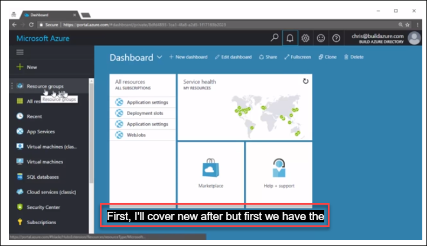

8.  Select the **Language** dropdown in the **Video** **Insights** pane, then change the language to **Chinese (Simplified)**.

    ")

9.  The **Closed Captions** and the **Transcript** will now be automatically translated into **Chinese (Simplified)**.

    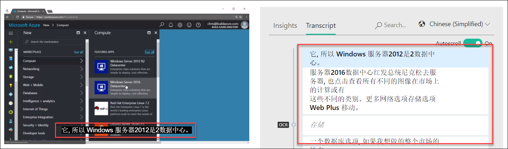

## After the hands-on lab

Duration: 10 minutes

### Task 1: Delete resources

1. Now that the hands-on lab is complete, go ahead and delete all the Resource Groups that were created for this lab. You will no longer need those resources and it will be beneficial to clean up your Azure Subscription.

You should follow all steps provided *after* attending the Hands-on lab.
